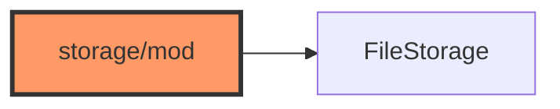

# storage/mod.rs

- **Path:** `core/src/storage/mod.rs`
- **Purpose:** Declares storage submodules, re-exports primary APIs, and defines `FileStorage` — the VFS-like trait implemented by `MockStorage` and firmware `SdStorage`.

## Component in architecture

## Responsibilities

- **Does:** submodule exports; `FileStorage` (`read_to_string`, `read_bytes`, `write_bytes`, `exists`, `remove`, `rename`, `atomic_write`, `write_string`, `atomic_write_string`)
- **Does not:** FAT driver

## Key types / functions

Re-exports: `NoteEntry`, `IndexStore`, `load_index`, `save_index`, `add_to_index`, …; `TagStore` + tag CRUD; `MockStorage`; meta helpers.

## Dependencies

Outbound: index/meta/mock/tags. Inbound: app, portal, whisper, record.

## Status

Host-verified.

## Related

[README.md](README.md), [../../architecture.md](../../architecture.md)
