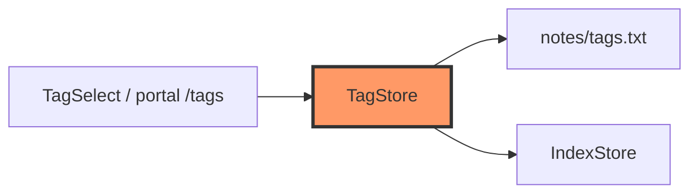

# storage/tags.rs

- **Path:** `core/src/storage/tags.rs`
- **Purpose:** Custom tag list in `notes/tags.txt` with defaults, add/delete rules (protected defaults, notes using a tag), and rename propagation onto the index.

## Component in architecture



## Responsibilities

- **Does:** load/save tags, add custom, delete with move/protect, `tag_has_notes`, `replace_tag_on_notes`
- **Does not:** render tag UI

## Key types / functions

| Item | Role |
|------|------|
| `TagStore` | `tags`, `count`, `contains_ignore_case`, `index_of*` |
| `load_tags` / `save_tags` | Atomic file I/O |
| `add_custom_tag` | Cap at `MAX_TAGS` |
| `delete_tag` | Policy + index updates |
| `tag_has_notes` / `replace_tag_on_notes` | Index coupling |

## Dependencies

Outbound: `paths`, `index`, `FileStorage`. Inbound: app, portal.

## Tests

```bash
cargo test -p zoop-core storage::tags::tests
```

## Status

Host-verified.

## Related

[index.md](index.md), [../../architecture.md](../../architecture.md)
