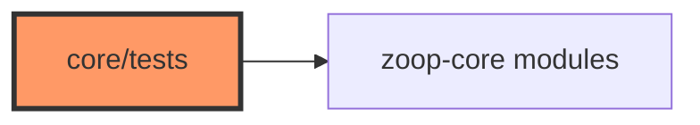

# Core integration tests

Integration tests under `core/tests/` exercise multi-module offline flows with `MockStorage` / mock BSP — complementary to per-module `#[cfg(test)]` units.

## Component in architecture



[architecture.md](../../architecture.md).

## Child docs

| Doc | Source |
|-----|--------|
| [integration_offline.md](integration_offline.md) | `integration_offline.rs` |
| [zoop_sim_flow.md](zoop_sim_flow.md) | `zoop_sim_flow.rs` |

## How to run

```bash
cargo test -p zoop-core --test integration_offline --test zoop_sim_flow
cargo test --workspace --exclude zoop-firmware
```

## Status

Host-verified on CI.
