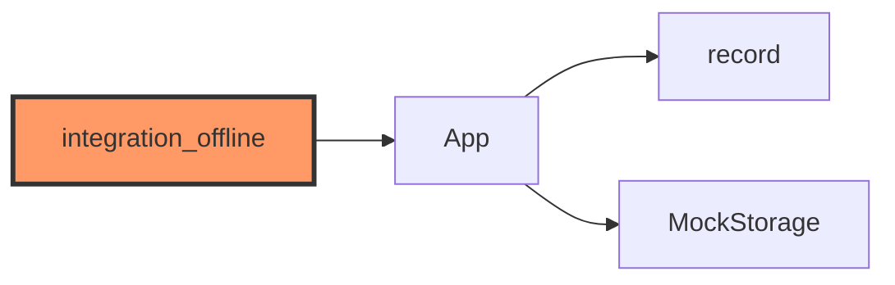

# tests/integration_offline.rs

- **Path:** `core/tests/integration_offline.rs`
- **Purpose:** End-to-end offline recording/tagging flow on mocks — proves `App` + storage + record integrate without network or hardware.

## Component in architecture



## Responsibilities

- **Does:** scripted hold-REC → finalize → tag → assert index/files
- **Does not:** WiFi/Whisper

## Key types / functions

Integration `#[test]` functions (see source) — no public library API.

## Dependencies

`zoop_core` public API + mocks.

## Tests

```bash
cargo test -p zoop-core --test integration_offline
```

## Status

Host-verified.

## Related

[README.md](README.md), [../record.md](../record.md), [../../architecture.md](../../architecture.md)
