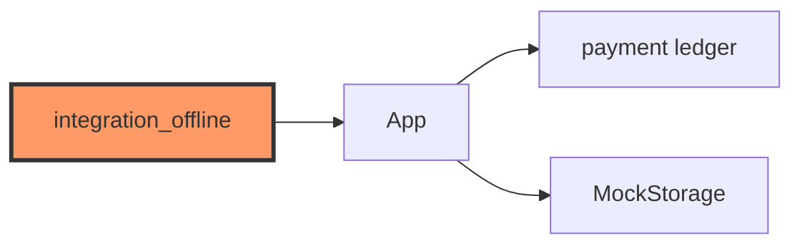

# tests/integration_offline.rs

- **Path:** `core/tests/integration_offline.rs`
- **Purpose:** End-to-end offline UPI collect flow on mocks — hold REC → QR → waiting → success → history detail without network or hardware.

## Component in architecture



## Responsibilities

- **Does:** scripted collect → assert ledger + History navigation
- **Does not:** WiFi / bank APIs

## Key types / functions

Integration `#[test]` functions (see source) — no public library API.

## Dependencies

`zoop_core` public API + mocks.

## Tests

```bash
cargo test -p zoop-core --test integration_offline
```

## Status

Host-verified.

## Related

[zoop_sim_flow.md](zoop_sim_flow.md), [../app.md](../app.md), [../payment.md](../payment.md)
