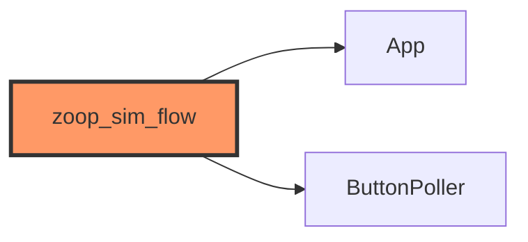

# tests/zoop_sim_flow.rs

- **Path:** `core/tests/zoop_sim_flow.rs`
- **Purpose:** Automated counterpart to `zoop-sim` — advances time and buttons through a menu/navigation smoke path and asserts expected `AppState`s.

## Component in architecture



## Responsibilities

Assert sim-like UX transitions on host.

## Key types / functions

`#[test]` only.

## Dependencies

`zoop_core` + mocks.

## Tests

```bash
cargo test -p zoop-core --test zoop_sim_flow
```

## Status

Host-verified.

## Related

[../bin/zoop_sim.md](../bin/zoop_sim.md), [README.md](README.md), [../../architecture.md](../../architecture.md)
