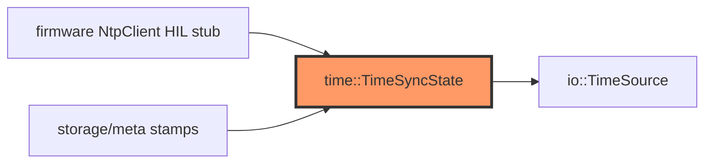

# time.rs

- **Path:** `core/src/time.rs`
- **Purpose:** NTP server rotation and “time ready” gating for note timestamps. Does not speak NTP wire protocol — firmware `NtpClient` drives success/failure into `TimeSyncState`.

## Component in architecture



## Responsibilities

- **Does:** server list, attempt counter, ready flag, `can_stamp_notes`
- **Does not:** UDP NTP or RTC I2C

## Key types / functions

| Item | Role |
|------|------|
| `NTP_SERVERS` | pool.ntp.org, time.google.com, time.cloudflare.com |
| `TimeSyncState::new` / `with_time_ready` | Construct |
| `current_server` | Active NTP host |
| `on_sync_failed` / `on_sync_success` | Advance policy |
| `attempt_count` / `can_stamp_notes` | Inspect |

## Dependencies

- **Outbound:** none
- **Inbound:** firmware `network/ntp`, meta stamping decisions

## Tests

```bash
cargo test -p zoop-core time::tests
```

## Status

Host-verified; SNTP HIL stub.

## Related

[../firmware/network/ntp.md](../firmware/network/ntp.md), [storage/meta.md](storage/meta.md), [../architecture.md](../architecture.md)
