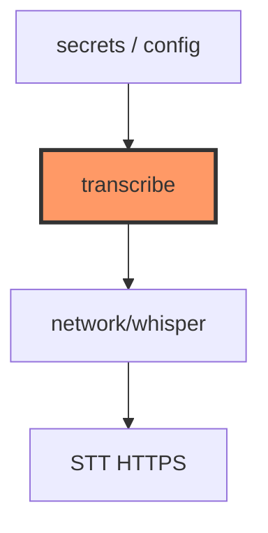

# transcribe.rs

- **Path:** `core/src/transcribe.rs`
- **Purpose:** Provider-selectable transcription HTTP framing (OpenAI Whisper vs Cursor API). Builds multipart preamble/epilogue, request heads, and parses JSON `text` — used by `network::whisper` without binding to a TLS stack.

## Component in architecture



## Responsibilities

- **Does:** provider enum, `TranscriptionConfig`, multipart helpers, response parse, `TranscribeError`
- **Does not:** open sockets (firmware ESP-TLS / test `HttpClient`)

## Key types / functions

| Item | Role |
|------|------|
| `TRANSCRIPTION_PATH` | `/v1/audio/transcriptions` |
| `DEFAULT_MODEL` | `whisper-1` |
| `DEFAULT_BOUNDARY` | `----ZoopBoundary` |
| `OPENAI_HOST` / `CURSOR_HOST` | API hosts |
| `TranscriptionProvider` | `parse`, `as_str`, `default_host` |
| `TranscriptionConfig::from_secrets` | Build from provider/key/host |
| `transcription_url`, `multipart_*`, `http_request_head` | Wire format |
| `parse_transcription_response` | Extract `text` |
| `TranscribeError` | Config/HTTP errors |

## Constants / formats

Multipart form field `file` + model; JSON body with `text`.

## Dependencies

- **Outbound:** std only
- **Inbound:** `network/whisper`, firmware secrets → config

## Tests

```bash
cargo test -p zoop-core transcribe::tests
```

## Status

Host-verified.

## Related

[network/whisper.md](network/whisper.md), [whisper_parse.md](whisper_parse.md), [../architecture.md](../architecture.md)
