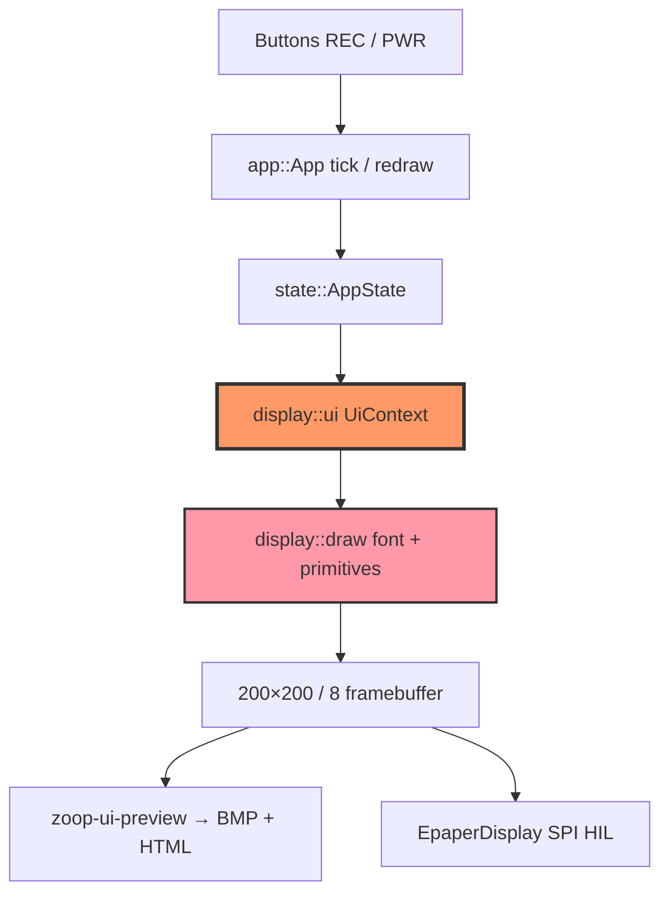
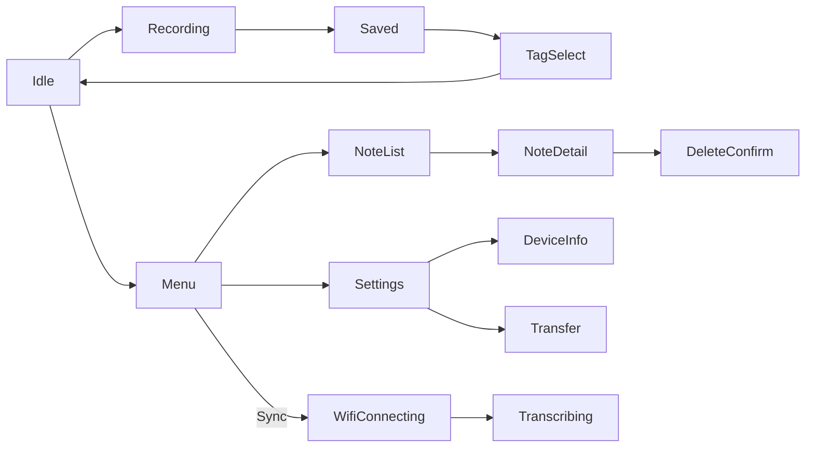

# UI capabilities

Host- and device-facing **E-Ink UI** for Zoop: custom immediate-mode drawing on a **200×200 monochrome** framebuffer (no Slint / LVGL / egui). Ports `pala_note` `ui.cpp` + `draw.cpp`.

## Quick start — see the UI on your Mac

```bash
cargo run -p zoop-core --bin zoop-ui-preview
```

Opens `target/ui-preview/index.html` with all **16 screens** rendered at 2× (same pixels as the Waveshare panel).

| Tool | Command | Purpose |
|------|---------|---------|
| **UI gallery** | `cargo run -p zoop-core --bin zoop-ui-preview` | Visual review of every screen |
| **Flow sim** | `cargo run -p zoop-core --bin zoop-sim` | Scripted button → state transitions |
| **Unit tests** | `cargo test -p zoop-core display::` | Framebuffer / layout assertions |

Docs: [bin/zoop_ui_preview.md](bin/zoop_ui_preview.md), [bin/zoop_sim.md](bin/zoop_sim.md), [display/ui.md](display/ui.md).

---

## Architecture (UI stack)



---

## Display capabilities (`draw.rs`)

| Capability | Detail |
|------------|--------|
| Resolution | **200 × 200** pixels, 1 bit (black / white) |
| Framebuffer | `(200×200)/8` = **5000 bytes**, MSB-first per byte, row-major |
| Pixels | `set_pixel`, `get_pixel` |
| Shapes | `fill_rect`, `hline`, `vline`, `line`, `fill_circle`, `stroke_circle` |
| Text | 5×7 bitmap font, **A–Z**, **0–9**, `. : - % # / ? ! + = _` |
| Case | Lowercase auto-mapped to uppercase for readability |
| Layout helpers | `draw_header` (28 px black bar), `draw_hints` (footer at y=180), `draw_str` / `draw_str_centered`, `text_width` |
| Battery | `draw_battery_ring(cx, cy, percent)` arc indicator |

Colors: `BLACK = 0`, `WHITE = 1`. Cleared screens fill `0xFF` (white).

---

## Screen catalog (`ui.rs`)

All screens use the same chrome: **header** (optional) + **body** + **hint bar** (`Hold REC` / `Menu` style labels).

| ScreenId | Trigger / state | What it shows | Hints (REC · PWR) |
|----------|-----------------|---------------|-------------------|
| **Idle** | Home | Brand `ZOOP`, note count, mic icon (concentric circles), battery % + ring | Hold REC · Menu |
| **Recording** | Hold REC | Header `RECORDING`, large record circle, “Release to stop” | — |
| **Saved** | After successful WAV | Header `SAVED`, check circle, “Pick a tag” | Save · Next tag |
| **TagSelect** | After save | Current tag name, “REC to save” | Save · Cycle |
| **Menu** | PWR from Idle | Notes / Tags / Sync / Settings; inverted row = selection | Select · Next |
| **Settings** | Menu → Settings | Sounds ON/OFF, Transfer, Device | Toggle · Next |
| **DeviceInfo** | Settings → Device | FW version, battery %, RTC, note count | Back · — |
| **NoteList** | Menu → Notes (or tag filter) | Filter title, note `#NNN`, “Voice note” | Open · Next |
| **NoteDetail** | Open note | `#NNN` + tag; up to **7 lines** of transcript per page | Play · Scroll |
| **DeleteConfirm** | Long-press on detail | Confirm delete `#NNN` | Yes · Back |
| **Transfer** | Settings → Transfer | “Portal active” + LAN IP | Exit · — |
| **Error** | Failures | Header `ERROR` + message (e.g. `SD ERR`, `NO WIFI`, `REC FAIL`) | Dismiss · — |
| **BatteryLow** | ≤15% overlay | “Low battery” / “Charge soon” | — |
| **UltraSleep** | Idle timeout / after tag | Centered “Sleeping” | — |
| **WifiConnecting** | Sync / transfer connect | “Connecting” + `attempt/max` | — |
| **Transcribing** | Sync progress | “Transcribing” + `done/pending` | — |



---

## Interaction model (2 buttons)

| Button | GPIO (board) | Events |
|--------|--------------|--------|
| **REC** | GPIO0 | Single, Long (≥600 ms), Double (≤200 ms gap), Hold (≥350 ms to start record) |
| **PWR** | GPIO18 | Single (debounced) — cycle / open menu |

Hints on each screen document the current mapping. Full transition table: [state.md](state.md), [architecture.md](../architecture.md).

---

## `UiContext` fields (what screens can show)

| Field | Used by |
|-------|---------|
| `battery_pct` | Idle, DeviceInfo |
| `firmware_version` | DeviceInfo |
| `note_count` | Idle, DeviceInfo |
| `menu_index` / `settings_index` / `tag_index` | Menu, Settings, TagSelect |
| `tags` | TagSelect |
| `list_filter`, `detail_num` | NoteList |
| `detail_tag`, `detail_lines`, `detail_page` | NoteDetail (7 lines/page) |
| `error_msg` | Error |
| `device_rtc` | DeviceInfo |
| `transfer_ip` | Transfer |
| `transcribe_done` / `transcribe_pending` | Transcribing |
| `sounds_on` | Settings label |

---

## Visual design rules (e-Ink / relaxing)

1. **No UI framework** — only `draw` + `ui` (see TODO locked stack).
2. **Paper metaphor** — white background, sparse black ink (less ghosting and eyestrain).
3. **Soft headers** — title + thin rule (`draw_soft_header`); solid black bars only for errors.
4. **Outline selection** — framed rows with a left accent (`draw_select_row`), not inverted slabs.
5. **Calm icons** — open rings / checks (`draw_calm_disc`, `draw_check`) instead of huge filled discs.
6. **Quiet microcopy** — “ready”, “listening…”, “resting”, “writing words”.
7. **Breathing room** — margins ≥12 px; note detail uses 6 airy lines (not 7 cramped).
8. **Immediate-mode** — full clear + redraw on state change (partial refresh is HIL on panel).
9. **Preview before flash** — always run `zoop-ui-preview` after UI changes.

---

## Preview gallery output

| Artifact | Path |
|----------|------|
| HTML gallery | `target/ui-preview/index.html` |
| Per-screen BMP | `target/ui-preview/01_idle.bmp` … `16_transcribing.bmp` |

Screen order in the gallery matches the table above (01–16).

---

## Related docs

| Doc | Topic |
|-----|-------|
| [display/README.md](display/README.md) | Display module overview |
| [display/ui.md](display/ui.md) | API for `ui.rs` |
| [display/draw.md](display/draw.md) | Primitives + font |
| [bin/zoop_ui_preview.md](bin/zoop_ui_preview.md) | Preview binary |
| [state.md](state.md) | `AppState` / transitions |
| [../firmware/display/README.md](../firmware/display/README.md) | Device E-Paper adapter (HIL) |
| [../architecture.md](../architecture.md) | System diagrams |
