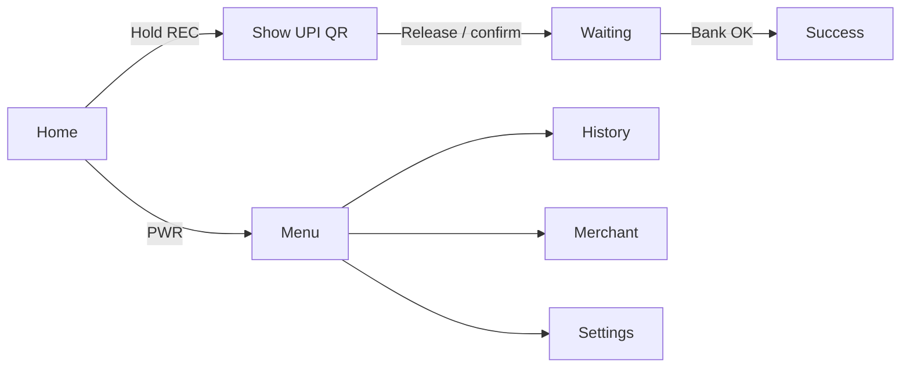
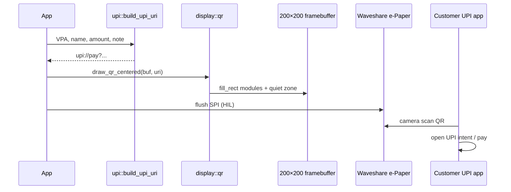

# UPI payment UI capabilities

Zoop’s on-device UI is now a **UPI collect flow** for the Waveshare **200×200 e-Paper** panel: calm paper-like screens plus a scannable **UPI QR**.

## Preview on Mac

```bash
cargo run -p zoop-core --bin zoop-ui-preview
open target/ui-preview/index.html
```

Sample merchant: **Akash Soni** · VPA **akash@oksbi** · amount **Rs 250**.

---

## Screen map (AppState → payment UI)

| AppState (buttons) | Screen | What you see |
|--------------------|--------|----------------|
| `Idle` | Home | ZOOP PAY, merchant, amount, “hold REC for QR” |
| `Recording` | **Show QR** | UPI QR (customer scans with GPay/PhonePe/etc.) |
| `Saved` | Waiting | Checking payment |
| `TagSelect` | Success | Paid + amount |
| `Menu` | Menu | Collect · History · Merchant · Settings |
| `NoteList` | History | Recent payments |
| `NoteDetail` | Txn detail | Lines for a payment |
| `DeleteConfirm` | Cancel | Stop this QR? |
| `Transfer` | Merchant | Name + VPA |
| `Settings` / `DeviceInfo` | Settings / Device | Same calm chrome |
| Overlays | Error, battery, resting, Wi‑Fi, sync | Status |



---

## Drawing capabilities

| Module | Role |
|--------|------|
| [`display/draw.rs`](display/draw.md) | Soft headers, outline selection, calm icons |
| [`display/qr.rs`](display/qr.md) | Encode payload → paint 1-bit modules on framebuffer |
| [`upi.rs`](../upi.md) | `build_upi_uri`, `format_amount_label` |

### UPI URI format

```
upi://pay?pa={VPA}&pn={Name}&am={Amount}&cu=INR&tn={Note}
```

Built by `zoop_core::build_upi_uri("akash@oksbi", "Akash Soni", "250.00", "Zoop Pay")`.

---

## How to show QR codes on this IoT e-Ink device

### Why e-Ink is a good QR surface

1. **QR is already 1-bit** — black modules on white; no grayscale needed.
2. **Static image** — once painted, the panel holds the image with almost no power (ideal while the customer opens their UPI app).
3. **High contrast** outdoors — reflective e-Paper stays readable in bright light (better than many LCDs for QR scanning).

### Pipeline on Zoop



### Implementation (already in `core`)

```rust
use zoop_core::{build_upi_uri, display::qr::draw_qr_centered};

let uri = build_upi_uri("akash@oksbi", "Akash Soni", "100.00", "Order 42");
clear_screen(buf);
draw_qr_centered(buf, &uri, 30)?; // top_y ≈ under soft header
display.flush()?;                  // firmware HIL: SPI to panel
```

### Size limits on 200×200

| Constraint | Guidance |
|------------|----------|
| Panel | 200×200 px usable |
| QR area | ≤ **140×140** px (`QR_MAX_PX`) + quiet zone |
| Module scale | Prefer ≥ **2–3 px/module** for phone cameras |
| Payload | Keep UPI string short (VPA + amount + short `tn`) |
| ECC | `qrcode` crate default ECC is fine; don’t stuff extra fields |

If `draw_qr_centered` fails or `qr_fits_panel` is false → shorten `tn` / omit optional params / show “QR too long”.

### Hardware bring-up tips (when board arrives)

1. Render QR on host with `zoop-ui-preview` (screen `02_qr_upi`) and scan with your phone — validates payload.
2. On device: full refresh once when showing QR (partial refresh can muddy fine modules).
3. Hold the QR screen steady 2–3 s before scanning; avoid angled glare.
4. Optional: bump to larger case / 2.9″ panel later if you need denser QR + more labels.

### Security notes

- Prefer **dynamic QR** with amount + order id (`tn`) per sale.
- Don’t put secrets in the QR — only VPA + public payee name + amount.
- Confirm payment via your backend / UPI collect API (device “Waiting” / “Sync” screens), not by trusting the scan alone.

---

## Related

| Doc | Topic |
|-----|-------|
| [display/qr.md](display/qr.md) | QR module API |
| [display/ui.md](display/ui.md) | Screen composers |
| [../upi.md](../upi.md) | UPI URI helpers |
| [../bin/zoop_ui_preview.md](../bin/zoop_ui_preview.md) | Gallery tool |
| [../../architecture.md](../../architecture.md) | System map |
