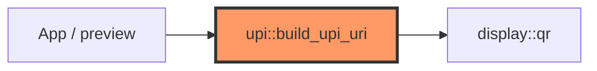

# upi.rs

- **Path:** `core/src/upi.rs`
- **Purpose:** Build NPCI-style UPI payment URIs and format amount labels for the e-Ink font (uses `Rs` — no ₹ glyph in the 5×7 bitmap).

## Component in architecture



## Key API

| Item | Role |
|------|------|
| `build_upi_uri(vpa, payee_name, amount_inr, note)` | `upi://pay?pa=&pn=&am=&cu=INR&tn=` |
| `format_amount_label(amount_inr)` | `"100.00"` → `"Rs 100"`; empty → `"any amount"` |

## Example

```rust
let uri = zoop_core::build_upi_uri(
    "akash@oksbi",
    "Akash Soni",
    "250.00",
    "Zoop Pay",
);
```

## Tests

```bash
cargo test -p zoop-core upi::
```

## Status

Host-verified.

## Related

[display/qr.md](display/qr.md) · [ui-capabilities.md](ui-capabilities.md)
