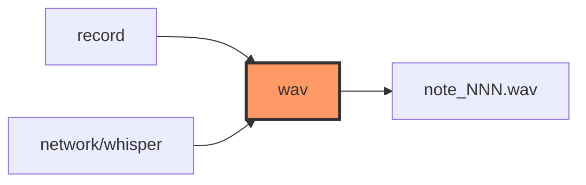

# wav.rs

- **Path:** `core/src/wav.rs`
- **Purpose:** 44-byte PCM WAV header build/parse for Zoop notes — 16 kHz, mono, 16-bit. Recording writes a header up front and rewrites sizes on finalize; portal/whisper rely on valid headers when serving or uploading.

## Component in architecture



## Responsibilities

- **Does:** constants, `WavHeader`, `build_wav_header`, `parse_wav_header`
- **Does not:** stream PCM or touch the filesystem

## Key types / functions

| Item | Role |
|------|------|
| `SAMPLE_RATE` | `16_000` |
| `CHANNELS` | `1` |
| `BITS_PER_SAMPLE` / `BYTES_PER_SAMPLE` | `16` / `2` |
| `HEADER_LEN` | `44` |
| `WavHeader` | `new_mono_pcm`, `byte_rate`, `block_align`, `riff_chunk_size`, `total_file_bytes` |
| `build_wav_header(data_bytes)` | `[u8; 44]` |
| `parse_wav_header(bytes)` | Validate + parse |

## Constants / formats

RIFF/WAVE fmt PCM; data chunk size = mono PCM bytes.

## Dependencies

- **Outbound:** `error`
- **Inbound:** `record`, whisper upload sizing, tests

## Tests

```bash
cargo test -p zoop-core wav::tests
```

## Status

Host-verified.

## Related

[record.md](record.md), [../architecture.md](../architecture.md)
