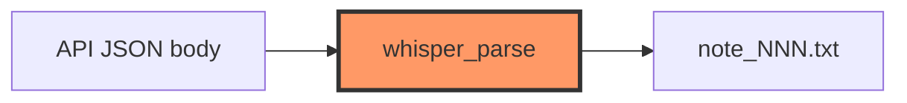

# whisper_parse.rs

- **Path:** `core/src/whisper_parse.rs`
- **Purpose:** Lightweight extraction of transcript text from Whisper-style JSON (and tolerant fallbacks). Shared helper so portal/tests can parse without pulling full HTTP client logic.

## Component in architecture



## Responsibilities

- **Does:** `parse_whisper_text(resp) -> Option<String>`
- **Does not:** HTTP, file I/O

## Key types / functions

| Item | Role |
|------|------|
| `parse_whisper_text` | Prefer JSON `"text"`; tolerate simple shapes |

## Dependencies

- **Outbound:** none
- **Inbound:** whisper flow / tests; related to `transcribe::parse_transcription_response`

## Tests

```bash
cargo test -p zoop-core whisper_parse::tests
```

## Status

Host-verified.

## Related

[transcribe.md](transcribe.md), [network/whisper.md](network/whisper.md), [../architecture.md](../architecture.md)
