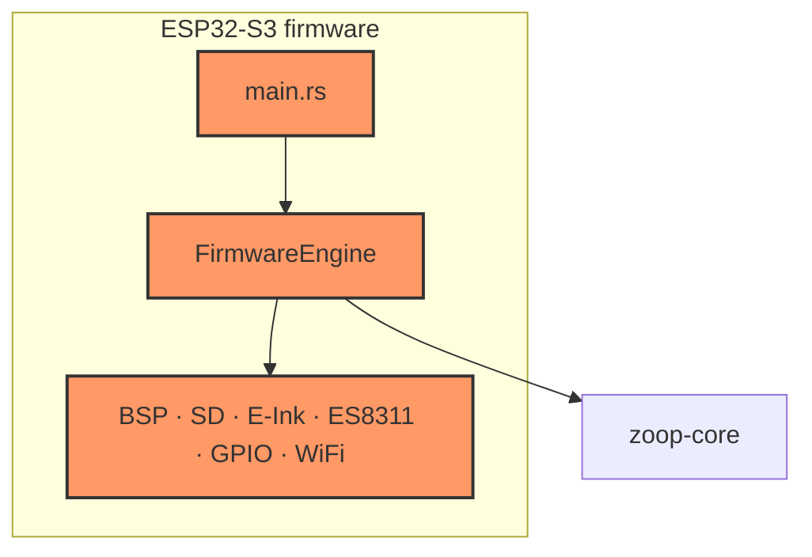

# Firmware crate (`zoop-firmware`)

ESP32-S3 board support package and thin engine over `zoop-core`. Most drivers are **HIL stubs** that log and compile for `xtensa-esp32s3-espidf` until Waveshare bring-up.

## Component in architecture



Full system map: [architecture.md](../architecture.md).

## Child docs

| Area | Docs |
|------|------|
| Entry | [main.md](main.md) |
| App | [app/](app/) |
| Board | [board/](board/) |
| Audio | [audio/](audio/) |
| Display | [display/](display/) |
| Input | [input/](input/) |
| Network | [network/](network/) |
| Power | [power/](power/) |
| Storage | [storage/](storage/) |

## How components interact

`main` inits power → display → SD → audio → RTC → whisper config → `FirmwareEngine::boot`/`tick` loop. Engine wraps `zoop_core::App` with BSP stubs (`SdStorage`, `EpaperDisplay`, `Es8311Audio`, `GpioButtons`, …).

## Build

```bash
cd firmware && cargo build
```

## Status

**Build-time / HIL stub** — compiles; hardware paths pending. Host logic verified in `zoop-core`.
