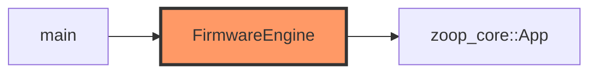

# Firmware app

Wraps `zoop_core::App` with device clocks, buttons, and BSP handles.

## Component in architecture

[architecture.md](../../architecture.md).

## Child docs

| Doc | Source |
|-----|--------|
| [mod.md](mod.md) | `app/mod.rs` |
| [engine.md](engine.md) | `app/engine.rs` |

## Status

HIL stub — engine boots when SD stub allows; full loop pending hardware.
