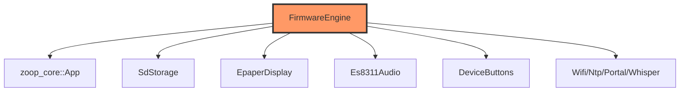
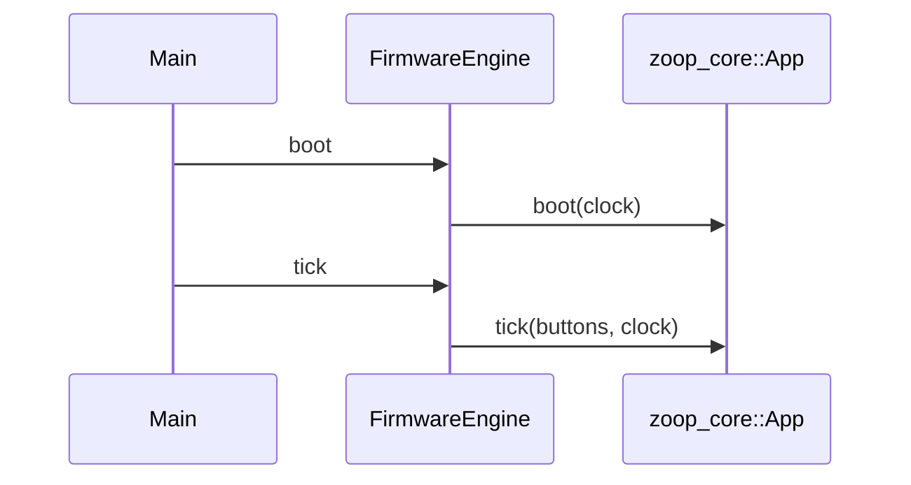

# app/engine.rs

- **Path:** `firmware/src/app/engine.rs`
- **Purpose:** Device-side application wrapper. Owns BSP stubs, `EspClock`, `FirmwareTime` (RTC+NTP), index/tag stores, and a `zoop_core::App`. `boot`/`tick` forward into core; full peripheral wiring awaits HIL.

## Component in architecture

## Responsibilities

- **Does:** construct core `App`, expose `boot`/`tick`, provide `Clock`/`TimeSource` stubs
- **Does not:** raw GPIO (other modules)

## Key types / functions

| Item | Role |
|------|------|
| `EspClock` | Monotonic `now_ms` stub |
| `FirmwareTime` | UTC cache + `NtpClient` + `RtcChip`; implements `TimeSource` |
| `FirmwareEngine::new` | Wire storage/display/audio/rtc/whisper |
| `boot` / `tick` | Delegate to core |

## Data / control flow

## Dependencies

Outbound: nearly all firmware BSP modules + `zoop_core`. Inbound: `main`.

## Tests

Firmware excluded from host CI. Build-only.

## Status

HIL stub.

## Related

[../../core/app.md](../../core/app.md), [../main.md](../main.md), [../../architecture.md](../../architecture.md)
