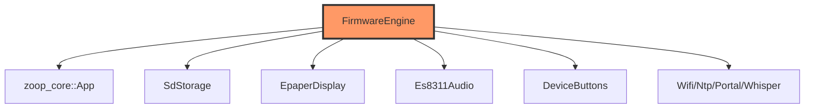

# app/engine.rs

- **Path:** `firmware/src/app/engine.rs`
- **Purpose:** Device-side application wrapper. Owns BSP stubs, `EspClock`, `FirmwareTime` (RTC+NTP), and drives `zoop_core::App` (payment ledger lives inside App). `boot`/`tick` forward into core; full peripheral wiring awaits HIL.

## Component in architecture

## Responsibilities

- **Does:** construct core `App`, expose `boot`/`tick`, provide `Clock`/`TimeSource` stubs
- **Does not:** raw GPIO (other modules); note: stub recreates `App` each tick (state not yet persisted across ticks — HIL follow-up)

## Key types / functions

| Item | Role |
|------|------|
| `EspClock` | Monotonic ms stub |
| `FirmwareTime` | RTC + NTP `TimeSource` |
| `FirmwareEngine` | Owns BSP + `boot` / `tick` |

## Dependencies

`zoop_core::App`, board/audio/display/input/network/power/storage stubs.

## Status

Stub / HIL pending.

## Related

[../README.md](../README.md), [../../core/app.md](../../core/app.md), [../../architecture.md](../../architecture.md)
