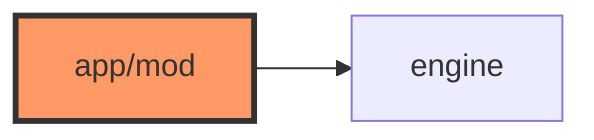

# app/mod.rs

- **Path:** `firmware/src/app/mod.rs`
- **Purpose:** Re-exports `FirmwareEngine` and commonly used core state/sound types for firmware modules.

## Component in architecture

## Responsibilities

Module glue: `pub use engine::FirmwareEngine`, `SoundsPolicy`, `AppState`, `StateMachine`, `Transition`.

## Key types / functions

Re-exports only.

## Dependencies

Outbound: `engine`, `zoop_core`. Inbound: `main`.

## Status

Build-time.

## Related

[engine.md](engine.md), [../../architecture.md](../../architecture.md)
