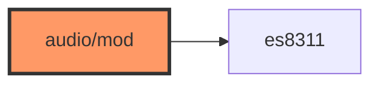

# audio/mod.rs

- **Path:** `firmware/src/audio/mod.rs`
- **Purpose:** Audio submodule root — declares `es8311` and re-exports `Es8311Audio` for `main` / engine.

## Component in architecture

## Responsibilities

- **Does:** module + re-export
- **Does not:** codec logic

## Key types / functions

`pub use es8311::Es8311Audio`

## Dependencies

- **Outbound:** `es8311`
- **Inbound:** `main`, `app::engine`

## Tests

Build-only.

## Status

Build-time glue.

## Related

[es8311.md](es8311.md), [../../architecture.md](../../architecture.md)
