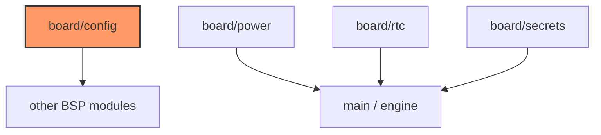

# Firmware board

Pin map, power rails, RTC, and build-time secrets for the Waveshare ESP32-S3 e-Paper 1.54 board.

## Component in architecture

[architecture.md](../../architecture.md).

## Child docs

| Doc | Source |
|-----|--------|
| [mod.md](mod.md) | `mod.rs` |
| [config.md](config.md) | `config.rs` |
| [power.md](power.md) | `power.rs` |
| [rtc.md](rtc.md) | `rtc.rs` |
| [secrets.md](secrets.md) | `secrets.rs` |

## Status

Constants ready; GPIO/I2C/secrets consumption mix of build-time and HIL stub.
