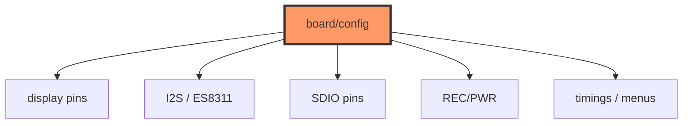

# board/config.rs

- **Path:** `firmware/src/board/config.rs`
- **Purpose:** Board pins, timing, paths, and menu labels — mirrors `pala_note` `config.h` / `board_cfg.h`. Single source of truth for GPIO numbers and UX constants on device.

## Component in architecture

## Responsibilities

- **Does:** publish `pub const` pin/timing/path/menu values
- **Does not:** drive hardware

## Key types / functions

| Group | Examples |
|-------|----------|
| Version / panel | `FIRMWARE_VERSION`, `EPD_WIDTH/HEIGHT` 200 |
| EPD SPI | `EPD_DC_PIN=10`, `CS=11`, `SCK=12`, `MOSI=13`, `RST=9`, `BUSY=8`, `PWR=6` |
| Power / bat | `AUDIO_PWR_PIN=42`, `VBAT_PWR_PIN=17`, `BAT_ADC_PIN=4` |
| Buttons | `BTN_REC=0`, `BTN_PWR=18` |
| I2C | SDA 47, SCL 48; RTC `0x51`, SHTC3 `0x70`, ES8311 `0x18` |
| SDIO | CLK 39, CMD 41, D0 40 |
| I2S | MCLK 14, BCLK 15, WS 38, DIN 16, DOUT 45, PA 46 |
| Audio | `SAMPLE_RATE=16000`, `REC_BUF=8*1024` |
| Paths | `SD_MOUNT=/sdcard`, `NOTES_DIR=/notes`, index/tag files |
| Timing | `REC_HOLD_MS=350`, `BTN_LONG_MS=600`, `DOUBLE_MS=200`, `ULTRA_SLEEP_MS=120000` |
| Battery | check 30s; low 15 / recover 20 |
| Menus | `MENU_ITEMS`, `SETTINGS_ITEMS`; `LOCAL_TIME_OFFSET_MIN=120` |

## Constants / formats

See table. Paths are absolute on-device vs core relative `notes/…`.

## Dependencies

None. Inbound: all BSP modules.

## Tests

Inline pin sanity `#[cfg(test)]` in source (not run on host CI for firmware target).

## Status

Constants ready; GPIO use is HIL.

## Related

[../../core/paths.md](../../core/paths.md), [power.md](power.md), [../../architecture.md](../../architecture.md)
