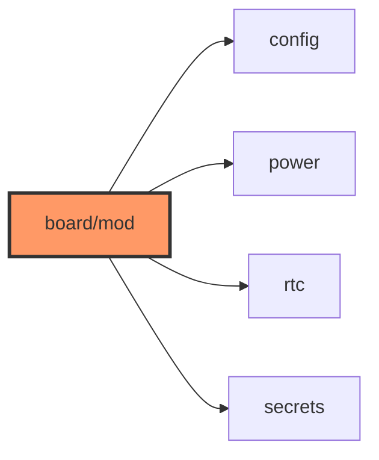

# board/mod.rs

- **Path:** `firmware/src/board/mod.rs`
- **Purpose:** Board submodule root — `config`, `power`, `rtc`, `secrets`.

## Component in architecture

## Responsibilities

- **Does:** declare board submodules
- **Does not:** pin values (see `config`)

## Key types / functions

Module declarations only (`pub mod config/power/rtc/secrets`).

## Dependencies

- **Outbound:** child modules
- **Inbound:** crate root `main.rs` (`mod board`)

## Tests

N/A.

## Status

Build-time.

## Related

[README.md](README.md), [config.md](config.md), [../../architecture.md](../../architecture.md)
