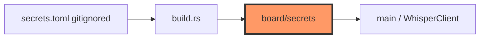

# board/secrets.rs

- **Path:** `firmware/src/board/secrets.rs`
- **Purpose:** Includes build-generated `secrets_config.rs` from `OUT_DIR` (produced by `build.rs` from gitignored `secrets.toml`). Exposes transcription provider/host/key constants to `main` without committing secrets.

## Component in architecture

## Responsibilities

- **Does:** `include!` generated constants (`TRANSCRIPTION_*`, etc.)
- **Does not:** parse TOML at runtime

## Key types / functions

Constants from generated file — typically provider, host, API key (see `secrets.example.toml`). Do not commit real `secrets.toml`.

## Dependencies

Build script output. Inbound: `main`.

## Tests

Build-time only.

## Status

Build-time.

## Related

[../../config/secrets.example.md](../../config/secrets.example.md), [../../config/build.md](../../config/build.md), [../../architecture.md](../../architecture.md)
