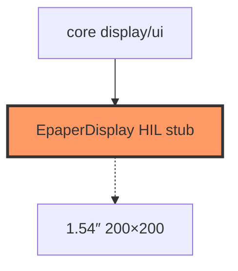

# Firmware display

E-Paper driver stub plus re-exports of core `draw`/`ui` for on-device use.

## Component in architecture

[architecture.md](../../architecture.md).

## Child docs

| Doc | Source |
|-----|--------|
| [mod.md](mod.md) | `mod.rs` |
| [epaper.md](epaper.md) | `epaper.rs` |
| [draw.md](draw.md) | `draw.rs` |
| [ui.md](ui.md) | `ui.rs` |

## Status

UI logic host-verified in core; SPI panel HIL stub.
