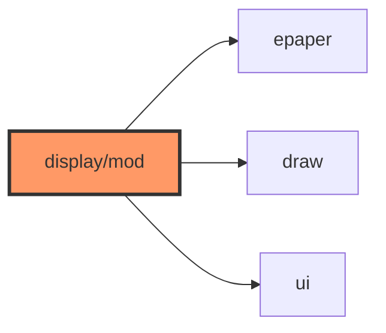

# display/mod.rs

- **Path:** `firmware/src/display/mod.rs`
- **Purpose:** Declares `draw`, `epaper`, `ui`; re-exports `EpaperDisplay`.

## Component in architecture

## Responsibilities

- **Does:** module tree + `EpaperDisplay` re-export
- **Does not:** paint pixels

## Key types / functions

`pub use epaper::EpaperDisplay`

## Dependencies

- **Outbound:** `draw`, `epaper`, `ui`
- **Inbound:** `main`, engine

## Tests

Build-only.

## Status

Build-time.

## Related

[README.md](README.md), [epaper.md](epaper.md), [../../architecture.md](../../architecture.md)
