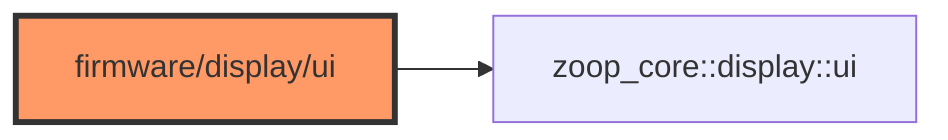

# display/ui.rs

- **Path:** `firmware/src/display/ui.rs`
- **Purpose:** Re-export of `zoop_core::display::ui::*` for firmware.

## Component in architecture

## Responsibilities

- **Does:** re-export core UI screens / `UiContext`
- **Does not:** own framebuffer flush (see `epaper`)

## Key types / functions

Same as [../../core/display/ui.md](../../core/display/ui.md).

## Dependencies

- **Outbound:** `zoop_core::display::ui`
- **Inbound:** engine / app redraw path

## Tests

Covered by core `display::ui::tests`.

## Status

Host-verified via core.

## Related

[draw.md](draw.md), [../../architecture.md](../../architecture.md)
