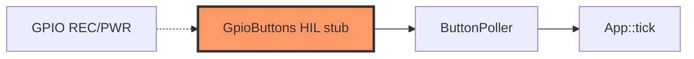

# Firmware input

GPIO button adapters for REC (GPIO0) and PWR (GPIO18).

## Component in architecture

[architecture.md](../../architecture.md).

## Child docs

| Doc | Source |
|-----|--------|
| [mod.md](mod.md) | `mod.rs` |
| [buttons.md](buttons.md) | `buttons.rs` |

## Status

HIL stub (reads return false).
