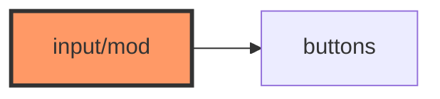

# input/mod.rs

- **Path:** `firmware/src/input/mod.rs`
- **Purpose:** Re-exports `DeviceButtons`, `GpioButtons`.

## Component in architecture

## Responsibilities

- **Does:** module + re-exports
- **Does not:** GPIO reads

## Key types / functions

`pub use buttons::{DeviceButtons, GpioButtons}`

## Dependencies

- **Outbound:** `buttons`
- **Inbound:** `app::engine`

## Tests

Build-only.

## Status

Build-time.

## Related

[buttons.md](buttons.md), [../../architecture.md](../../architecture.md)
