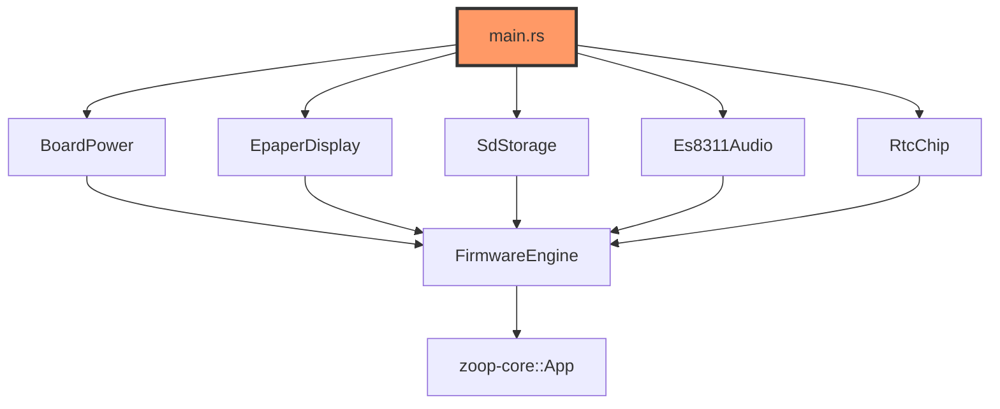
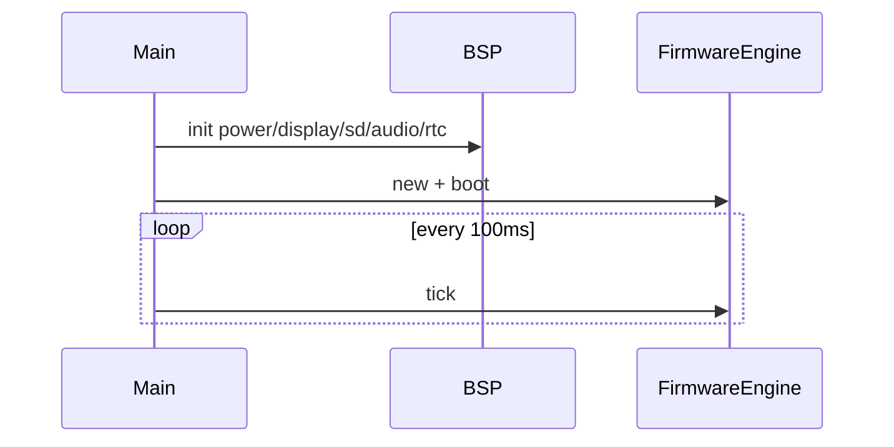

# main.rs

- **Path:** `firmware/src/main.rs`
- **Purpose:** Firmware entry point. Links ESP-IDF patches, initializes logging, power rails, e-Paper, SD stub, ES8311 stub, RTC stub, Whisper config from build-time secrets, network stubs, then runs `FirmwareEngine` in a 100 ms sleep loop until HIL timers exist.

## Component in architecture

## Responsibilities

- **Does:** bring-up order, secrets→`TranscriptionConfig`, engine loop
- **Does not:** implement drivers (delegates to modules)

## Key types / functions

`fn main()` only — no public API.

## Data / control flow

## Dependencies

Outbound: all firmware modules + `zoop_core::transcribe::TranscriptionConfig`. Inbound: ESP-IDF runtime.

## Constants / formats

Logs `FIRMWARE_VERSION`, `TRANSCRIPTION_PROVIDER`, `TRANSCRIPTION_HOST`.

## Tests

No host tests (excluded from CI workspace test). Build: `cd firmware && cargo build`.

## Status

HIL stub / build-time.

## Related

[app/engine.md](app/engine.md), [board/secrets.md](board/secrets.md), [../architecture.md](../architecture.md)
