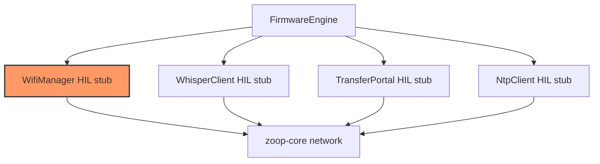

# Firmware network

Shells over core WiFi/Whisper/portal/NTP policy. Device stacks (STA, HTTP server, SNTP, ESP-TLS) are HIL stubs.

## Component in architecture

[architecture.md](../../architecture.md).

## Child docs

| Doc | Source |
|-----|--------|
| [mod.md](mod.md) | `mod.rs` |
| [wifi.md](wifi.md) | `wifi.rs` |
| [ntp.md](ntp.md) | `ntp.rs` |
| [portal.md](portal.md) | `portal.rs` |
| [whisper.md](whisper.md) | `whisper.rs` |

## Status

HIL stub — `init_network_stubs()` logs Phase 3 pending.
