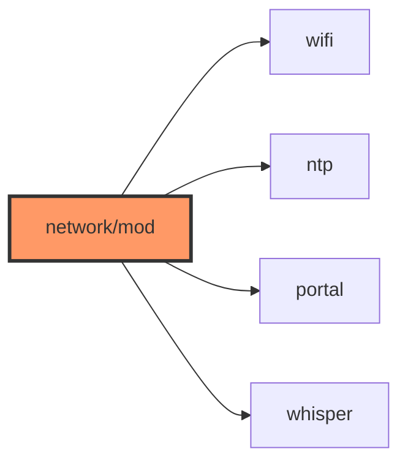

# network/mod.rs

- **Path:** `firmware/src/network/mod.rs`
- **Purpose:** Declares ntp/portal/whisper/wifi; `init_network_stubs()` constructs managers and logs HIL pending.

## Component in architecture

## Responsibilities

- **Does:** submodule exports; boot-time stub smoke init
- **Does not:** open sockets

## Key types / functions

| Item | Role |
|------|------|
| Re-exports | `NtpClient`, `TransferPortal`, `WhisperClient`, `WifiManager` |
| `init_network_stubs` | Construct stubs + log Phase 3 pending |

## Dependencies

- **Outbound:** child modules
- **Inbound:** `main`

## Tests

Build-only.

## Status

HIL stub.

## Related

[README.md](README.md), [../../architecture.md](../../architecture.md)
