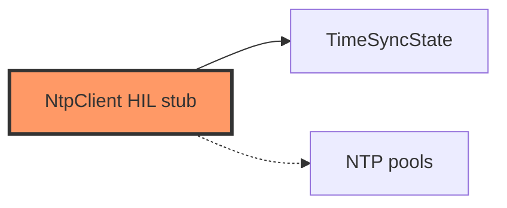

# network/ntp.rs

- **Path:** `firmware/src/network/ntp.rs`
- **Purpose:** NTP client stub wrapping `TimeSyncState`. `sync_step` logs server and returns `false` until SNTP is wired; success/failure update core policy.

## Component in architecture

## Responsibilities

- **Does:** wrap sync policy; apply success/failure to `TimeSource`
- **Does not:** UDP SNTP yet

## Key types / functions

| Item | Role |
|------|------|
| `NtpClient::new` | Fresh `TimeSyncState` |
| `sync_step` | Stub attempt → `Ok(false)` |
| `on_success` / `on_failure` | Update time + policy |

## Dependencies

- **Outbound:** `zoop_core::{time::TimeSyncState, io::TimeSource, error}`
- **Inbound:** `FirmwareTime`, network init

## Tests

Core `time::tests`; firmware build-only.

## Status

HIL stub.

## Related

[../../core/time.md](../../core/time.md), [../../architecture.md](../../architecture.md)
