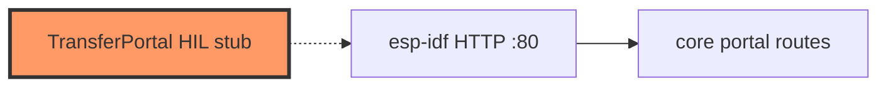
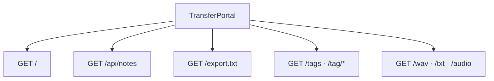

# network/portal.rs

- **Path:** `firmware/src/network/portal.rs`
- **Purpose:** Transfer-mode HTTP server shell. `start(ip)` / `stop` toggle `active` and log; will wrap `zoop_core::network::portal` handlers with esp-idf HTTP server.

## Component in architecture

## Responsibilities

- **Does:** track transfer-mode active flag; log URL
- **Does not:** bind port yet

## Key types / functions

| Item | Role |
|------|------|
| `TransferPortal` | `active` flag |
| `start` / `stop` | Log transfer mode |

## HTTP routes (core — to be wired)

## Dependencies

- **Outbound:** logging only today; future `zoop_core::network::portal`
- **Inbound:** engine / network init

## Tests

Core portal tests; firmware build-only.

## Status

HIL stub.

## Related

[../../core/network/portal.md](../../core/network/portal.md), [../../architecture.md](../../architecture.md)
