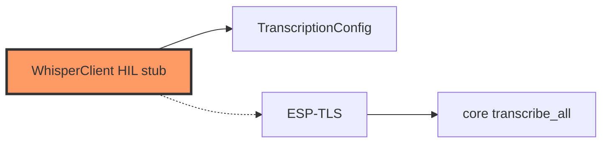

# network/whisper.rs

- **Path:** `firmware/src/network/whisper.rs`
- **Purpose:** Holds optional `TranscriptionConfig` from secrets; logs host. Upload path will call `zoop_core::network::whisper` with an ESP-TLS `HttpClient`.

## Component in architecture

## Responsibilities

- **Does:** store config; boot log
- **Does not:** HTTPS upload yet

## Key types / functions

| Item | Role |
|------|------|
| `WhisperClient::new` | Store config |
| `log_config` | Boot diagnostics |

## Dependencies

- **Outbound:** `zoop_core::transcribe::TranscriptionConfig`
- **Inbound:** `main`, engine

## Tests

Core whisper/transcribe tests; firmware build-only.

## Status

HIL stub.

## Related

[../../core/network/whisper.md](../../core/network/whisper.md), [../board/secrets.md](../board/secrets.md), [../../architecture.md](../../architecture.md)
