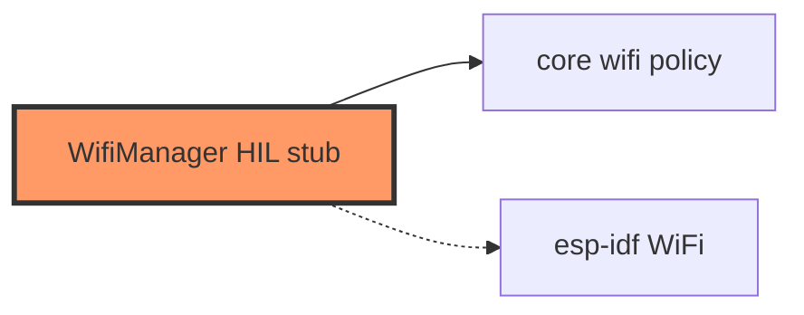

# network/wifi.rs

- **Path:** `firmware/src/network/wifi.rs`
- **Purpose:** STA manager shell calling `zoop_core::network::wifi::advance_wifi_connect`. Logs phase; no esp-idf WiFi yet.

## Component in architecture

## Responsibilities

- **Does:** hold `WifiConnectPhase`; step policy
- **Does not:** associate/scan radio

## Key types / functions

| Item | Role |
|------|------|
| `WifiManager` | Holds `WifiConnectPhase` |
| `connect_step(connected, elapsed_ms)` | Advance policy (`SYNC_RETRY_MS` 500, `SYNC_MAX_ATTEMPTS`) |

## Dependencies

- **Outbound:** `zoop_core::network::wifi`
- **Inbound:** engine / `init_network_stubs`

## Tests

Policy covered in core; this shell is build-only.

## Status

HIL stub.

## Related

[../../core/network/wifi.md](../../core/network/wifi.md), [../../architecture.md](../../architecture.md)
