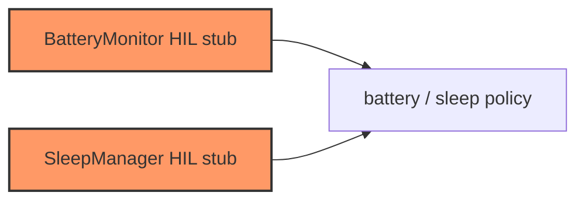

# Firmware power

Battery ADC monitor and ultra-sleep manager stubs.

## Component in architecture

[architecture.md](../../architecture.md).

## Child docs

| Doc | Source |
|-----|--------|
| [mod.md](mod.md) | `power/mod.rs` |
| [sleep.md](sleep.md) | `power/sleep.rs` |

## Status

HIL stub (ADC returns fixed samples; sleep logs only).
