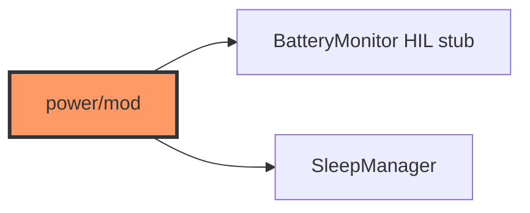

# power/mod.rs

- **Path:** `firmware/src/power/mod.rs`
- **Purpose:** `BatteryMonitor` implementing `BatteryAdc` with stub millivolt samples, plus `sleep` submodule re-export.

## Component in architecture

## Responsibilities

- **Does:** ADC stub → percent; export `SleepManager`
- **Does not:** real ADC DMA

## Key types / functions

| Item | Role |
|------|------|
| `BatteryMonitor::read_percent` | Samples → `battery_percent_from_adc_samples` |
| `BatteryAdc::read_mv_samples` | Stub `vec![2100; 16]` |

## Dependencies

- **Outbound:** `zoop_core::battery`, `io::BatteryAdc`, `board::config::BAT_ADC_PIN`, `sleep`
- **Inbound:** engine

## Constants / formats

Uses `BAT_ADC_PIN` (GPIO 4).

## Tests

Core battery tests; firmware build-only.

## Status

HIL stub.

## Related

[sleep.md](sleep.md), [../../core/battery.md](../../core/battery.md), [../../architecture.md](../../architecture.md)
