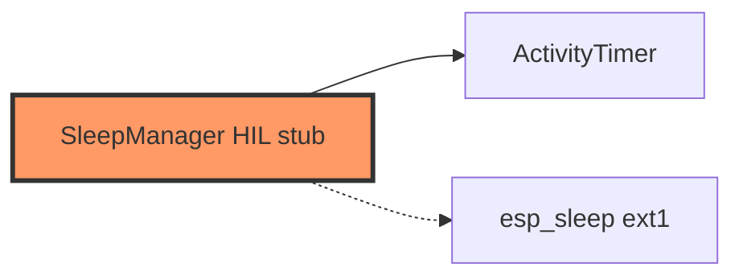

# power/sleep.rs

- **Path:** `firmware/src/power/sleep.rs`
- **Purpose:** Ultra-sleep wrapper around `ActivityTimer`. `enter_ultra_sleep` logs ext1 wake on REC+PWR — actual `esp_deep_sleep` pending HIL.

## Component in architecture

## Responsibilities

- **Does:** idle policy check; log sleep entry
- **Does not:** configure ext1 wakeup hardware yet

## Key types / functions

| Item | Role |
|------|------|
| `SleepManager::new` | Default `ActivityTimer` |
| `should_sleep(state, now_ms)` | Delegate to core |
| `enter_ultra_sleep` | Log HIL pending |

## Dependencies

- **Outbound:** `zoop_core::sleep::ActivityTimer`, `state::AppState`, board button/timing consts
- **Inbound:** engine

## Constants / formats

`ULTRA_SLEEP_MS` 120_000; wake GPIOs `BTN_REC`, `BTN_PWR`.

## Tests

Core `sleep::tests`; firmware build-only.

## Status

HIL stub.

## Related

[../../core/sleep.md](../../core/sleep.md), [../../architecture.md](../../architecture.md)
