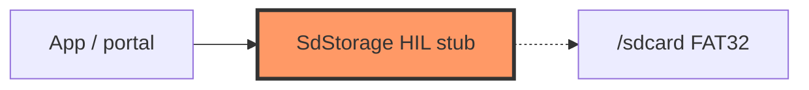

# Firmware storage

SD card VFS adapter implementing `FileStorage` (HIL stub until SDIO mount works).

## Component in architecture

[architecture.md](../../architecture.md).

## Child docs

| Doc | Source |
|-----|--------|
| [mod.md](mod.md) | `mod.rs` |
| [sd.md](sd.md) | `sd.rs` |

## Status

HIL stub.
