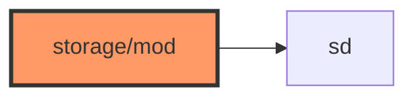

# storage/mod.rs

- **Path:** `firmware/src/storage/mod.rs`
- **Purpose:** Re-exports `SdStorage`.

## Component in architecture

## Responsibilities

- **Does:** module + re-export
- **Does not:** SDIO

## Key types / functions

`pub use sd::SdStorage`

## Dependencies

- **Outbound:** `sd`
- **Inbound:** `main`, engine

## Tests

Build-only.

## Status

Build-time.

## Related

[sd.md](sd.md), [../../architecture.md](../../architecture.md)
