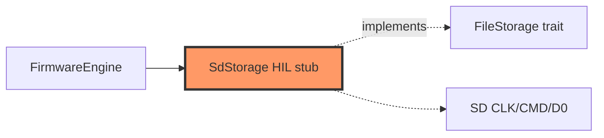

# storage/sd.rs

- **Path:** `firmware/src/storage/sd.rs`
- **Purpose:** `FileStorage` stub for microSD via SDIO. `mount` succeeds as a stub object; reads/writes return storage errors until VFS FAT is connected at `SD_MOUNT`.

## Component in architecture

## Responsibilities

- **Does:** compile-time `FileStorage` surface; log stub I/O
- **Does not:** mount FAT yet

## Key types / functions

| Item | Role |
|------|------|
| `SdStorage::mount` | Log + return stub `Ok` |
| `FileStorage` impl | read/write/exists/remove → stub errors / false |

## Dependencies

- **Outbound:** `zoop_core::{storage::FileStorage, error}`, board path consts
- **Inbound:** `main`, `FirmwareEngine`

## Constants / formats

`SD_MOUNT=/sdcard`; notes under `/notes` per board config (core uses relative `notes/`).

## Tests

Core storage tests on `MockStorage`; firmware build-only.

## Status

HIL stub.

## Related

[../../core/storage/mod.md](../../core/storage/mod.md), [../board/config.md](../board/config.md), [../../architecture.md](../../architecture.md)
