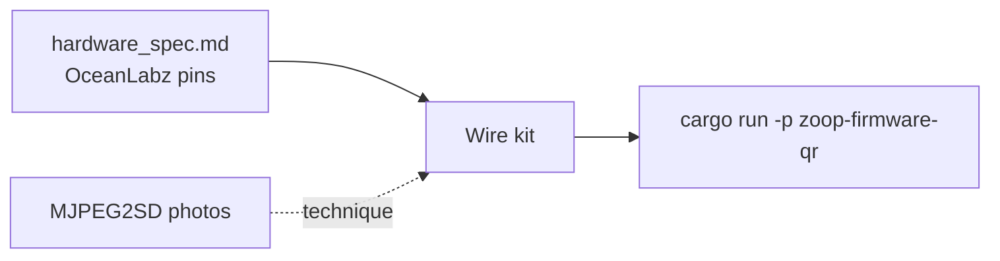
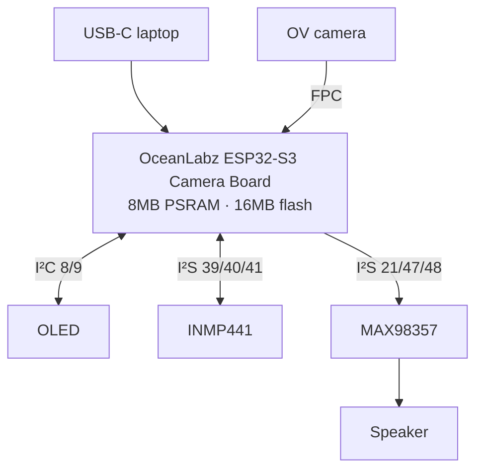
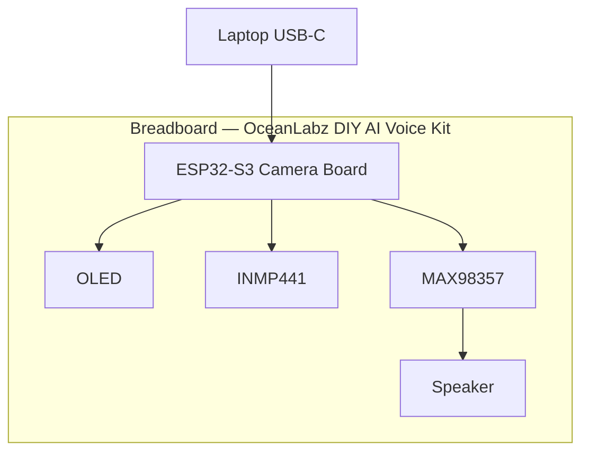
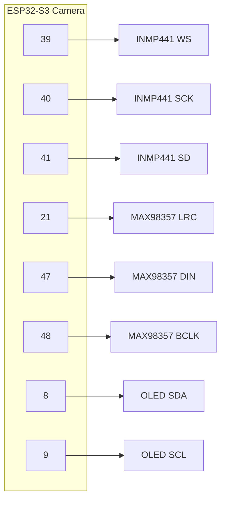

# Physical components — OceanLabz DIY AI Voice Kit

Step-by-step guide for assembling the **OceanLabz DIY AI Voice Kit** (ESP32-S3 Camera Board + OLED + INMP441 + MAX98357 + speaker) and getting from **“board shows up on USB”** to **running Zoop**.

| Doc | When to use it |
| --- | --- |
| **[`hardware_spec.md`](./hardware_spec.md)** | **Source of truth** — SKU, specs, GPIOs (agents & humans: refer here first) |
| This file | Breadboard basics, wiring steps, first power-on |
| [`scripts/README.md`](../scripts/README.md) | Install Rust / esp-rs on a fresh laptop |
| [§ Public repos](#public-repos--see-the-connections) | Community photos to *see* cam / I²C wiring technique |
| [`TODO_qr.md`](../TODO_qr.md) | QR scan → string product track |
| [`firmware-qr/`](../firmware-qr/) | Host decode + OLED UI demo |

**Assumes software tools are installed** ([`scripts/README.md`](../scripts/README.md)).

> **Safety:** Power off (unplug USB) before changing wires. Never short **3V3** to **GND**. Speakers go on the amp’s **Audio+/Audio−**, not on ESP32 GPIO. OceanLabz amp guides often use **5V** for MAX98357 Vin — follow [`hardware_spec.md`](./hardware_spec.md).

---

## Your kit (locked)

**DIY AI Voice Kit with ESP32-S3 Camera Board | OLED, INMP441 Microphone, MAX98357 DAC, Speaker & More!**  
Brand: **OceanLabz** · Model: Starter Kit / ESP32 Basic ST Kit · ASIN [B0G26QNQLD](https://www.amazon.in/dp/B0G26QNQLD)

| Spec (typical) | Value |
| --- | --- |
| MCU | Espressif ESP32-S3 (dual-core, up to 240 MHz) |
| PSRAM | ~8 MB (listing “RAM”) |
| Flash | ~16 MB |
| Radio | Wi‑Fi 2.4 GHz + Bluetooth |
| USB | 1× Type‑C |

Full listing fields + pin table → **[`hardware_spec.md`](./hardware_spec.md)** only.

---

## Public repos — see the connections

Pins for **this** OceanLabz kit live in [`hardware_spec.md`](./hardware_spec.md). Use public repos to **see** how camera boards and I²C look when wired (technique only — GPIO numbers may differ).

### Primary: [s60sc/ESP32-CAM_MJPEG2SD](https://github.com/s60sc/ESP32-CAM_MJPEG2SD)

| Look at this | Why |
| --- | --- |
| [README](https://github.com/s60sc/ESP32-CAM_MJPEG2SD) | ESP32-S3 cam boards, mic/amp/I²C notes |
| [extras/I2C.jpg](https://github.com/s60sc/ESP32-CAM_MJPEG2SD/blob/master/extras/I2C.jpg) | Photo of I²C taps on a cam board |
| [Audio](https://github.com/s60sc/ESP32-CAM_MJPEG2SD#audio-recording) / [Amplifier](https://github.com/s60sc/ESP32-CAM_MJPEG2SD#amplifier) | INMP441 + I²S amp concepts |
| [`camera_pins.h`](https://github.com/s60sc/ESP32-CAM_MJPEG2SD/blob/master/camera_pins.h) | Which GPIOs the OV sensor already uses |

### OceanLabz sibling guides

| Page | Notes |
| --- | --- |
| [DIY AI Voice Kit product](https://www.oceanlabz.in/product/diy-ai-voice-kit-with-esp32-s3-camera-board-oled-inmp441-microphone-max98357-dac-speaker-more-smart-voice-vision-development-kit-for-ai-projects/) | Your product family |
| [ESP32-S3 Camera + TFT](https://www.oceanlabz.in/esp32-s3-tft-cam/) | Camera-board **mic/amp** pin reference used in our draft |
| [ESP32-S3 + OLED](https://www.oceanlabz.in/esp32-s3-with-0-96-inc-oled-display/) | OLED-only board (different GPIOs — don’t mix blindly) |



---

## 1. What’s in the box

Unpack and tick (kit lists ~**13** pieces; marketing “box contents” highlight the four smart parts):

| # | Part | Role |
| --- | --- | --- |
| 1 | **ESP32-S3 Camera Board** | Brain — Wi‑Fi, BLE, USB, camera FPC |
| 2 | **Camera module** | Vision / QR frames |
| 3 | **OLED 1.54″** | Status UI (128×64) |
| 4 | **INMP441** | Voice in |
| 5 | **MAX98357** | Audio out amp |
| 6 | **Speaker** | Sound |
| 7 | Breadboard + jumpers + USB cable | Build & flash |
| 8 | (Optional extras) | Buttons, etc. |

---

## 2. Big picture



Exact GPIOs: [`hardware_spec.md` §4](./hardware_spec.md#41-zoop-draft-camera-board--oled-kit).

---

## 3. Breadboard basics

```text
        +  +  -  -     ← power rails
     ┌────────────────────────────┐
     │ a b c d e   f g h i j     │
  1  │ ○ ○ ○ ○ ○   ○ ○ ○ ○ ○     │  ← a–e connected; gap breaks to f–j
     └────────────────────────────┘
```

1. Same row `a–e` = connected; center trench isolates left/right.  
2. Run **3V3 → + rail**, **GND → − rail**; every module shares GND.  
3. MAX98357 **Vin** may need **5V** (USB 5V pin) per OceanLabz — see hardware_spec.  
4. Color tip: red = power, black = GND, yellow = clocks, green/blue = data.

### Breadboard with OceanLabz kit installed

```text
                    USB-C ──► laptop
                         │
                    ┌────┴────┐
                    │  lens   │  ◄── camera on FPC (not in breadboard holes)
                    └────┬────┘
  +3V3 / +5V / GND rails ════════════════════════════════════
       ┌──────────────────────────────────────────────────────────┐
       │                                                          │
       │           ┌──────────────────────┐                       │
       │           │ OceanLabz ESP32-S3   │  BOOT · RST           │
       │           │ Camera Board         │                       │
       │           │ (straddles center ║) │                       │
       │           └──────────┬───────────┘                       │
       │                      │                                   │
       │                      │   ┌─────────────┐                 │
       │                      ├──►│ OLED 1.54″ 128×64 │  SDA=8 SCL=9    │
       │                      │   └─────────────┘                 │
       │                      │   ┌─────────────┐                 │
       │                      ├──►│  INMP441    │  WS=39 SCK=40   │
       │                      │   │  microphone │  SD=41          │
       │                      │   └─────────────┘                 │
       │                      │   ┌─────────────┐    ┌─────────┐  │
       │                      └──►│  MAX98357   │───►│ SPEAKER │  │
       │                          │  DIN=47     │    └─────────┘  │
       │                          │  BCLK=48    │                 │
       │                          │  LRC=21     │                 │
       │                          └─────────────┘                 │
       └──────────────────────────────────────────────────────────┘
```



---

## 4. Identify each part

| Part | Labels to find |
| --- | --- |
| ESP32-S3 Camera Board | USB-C, BOOT, RST, camera FPC, GPIO silk |
| OLED 1.54″ | `VCC` `GND` `SCL` `SDA` — use **3V3**; module ~42×38 mm |
| INMP441 | `VDD` `GND` `WS` `SCK` `SD` `L/R` — **L/R → GND** |
| MAX98357 | `DIN` `BCLK` `LRC` `Vin` `GND` `GAIN` + speaker pads |
| Speaker | Two wires → amp Audio+ / Audio− |

Camera ribbon: power off → lift latch → insert → close latch.

---

## 5. Wiring — step by step

**Canonical table:** [`hardware_spec.md` §4.1](./hardware_spec.md#41-zoop-draft-camera-board--oled-kit).  
If the card in your box disagrees, update **hardware_spec.md** and `firmware-qr/src/board/pins.rs` together.



### Step 0 — Rails

| From board | To |
| --- | --- |
| **3V3** | Breadboard `+` (for OLED + mic) |
| **GND** | Breadboard `−` |
| **5V** (if present) | Amp Vin when required by kit card |

### Step 1 — Camera FPC

Seat ribbon only — no Dupont.

### Step 2 — INMP441

| ESP32 | INMP441 |
| --- | --- |
| GPIO **39** | WS |
| GPIO **40** | SCK |
| GPIO **41** | SD |
| **3V3** | VDD |
| **GND** | GND + L/R |

### Step 3 — MAX98357 + speaker

| ESP32 | MAX98357 |
| --- | --- |
| GPIO **47** | DIN |
| GPIO **48** | BCLK |
| GPIO **21** | LRC |
| **5V** or **3V3** | Vin (per kit card) |
| **GND** | GND (+ GAIN→GND common) |
| — | Audio+/− → speaker |

### Step 4 — OLED

| ESP32 | OLED |
| --- | --- |
| GPIO **8** | SDA |
| GPIO **9** | SCL |
| **3V3** | VCC |
| **GND** | GND |

### Step 5 — Optional buttons

| Function | GPIO | Wiring |
| --- | --- | --- |
| REC | **0** (BOOT) | to GND |
| PWR | **14** (draft) | to GND |

### Step 6 — Checklist

- [ ] Common GND  
- [ ] Speaker only on amp  
- [ ] Camera latch closed  
- [ ] Data-capable USB‑C  

---

## 6. First power-on

1. Plug USB‑C (data cable).  
2. Confirm serial port (`/dev/cu.usb*` · `/dev/ttyACM*` · COMx).  
3. That is hardware hello — flash comes later.

---

## 7. Software: hello → Zoop

```bash
# tools
bash scripts/macos-setup.sh --host-only   # or linux / windows / termux

# host demo (no board firmware required)
cargo test -p zoop-core qr::
cargo run -p zoop-firmware-qr

# ESP toolchain + practice flash (e-Paper crate may not match this kit’s pins)
. ~/export-esp.sh
cd firmware && cargo build
```

Camera / QR on **this** kit: [`TODO_qr.md`](../TODO_qr.md) Phase 3 · pins from [`hardware_spec.md`](./hardware_spec.md).

---

## 8. Learning ladder

| Step | Success |
| --- | --- |
| 1 Unpack + rails | No shorts |
| 2 USB port seen | COM / tty appears |
| 3 Host Zoop demo | JSON from `zoop-firmware-qr` |
| 4 Wire OLED | Screen gets power / later UI |
| 5 Wire amp + speaker | Beep from test firmware |
| 6 Wire mic | Levels / I²S path |
| 7 Camera + QR | String on UART / OLED |

---

## 9. Pin cheat sheet

Copy of [`hardware_spec.md`](./hardware_spec.md) — edit there first.

| Function | GPIO |
| --- | --- |
| Mic WS / SCK / SD | 39 / 40 / 41 |
| Amp LRC / DIN / BCLK | 21 / 47 / 48 |
| OLED SDA / SCL | 8 / 9 |
| REC / PWR | 0 / 14 |

Code: [`firmware-qr/src/board/pins.rs`](../firmware-qr/src/board/pins.rs).

---

## 10. Common mistakes

| Mistake | Fix |
| --- | --- |
| Using old KS5028 pin tables | Use **hardware_spec.md** only |
| Mixing OceanLabz OLED-only GPIOs with camera-board audio | Camera kit uses §4.1 draft |
| Charge-only USB cable | Data cable |
| Speaker on GPIO | Through MAX98357 |
| Amp with no 5V when guide requires it | Check Vin rail |
| Changing wires but not `pins.rs` | Keep spec + code in sync |
