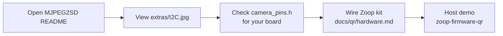
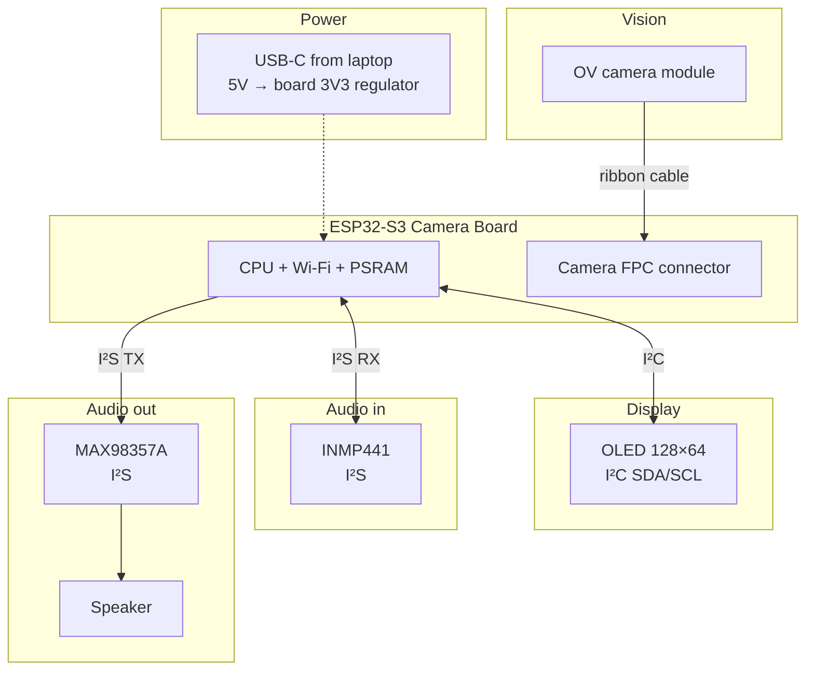
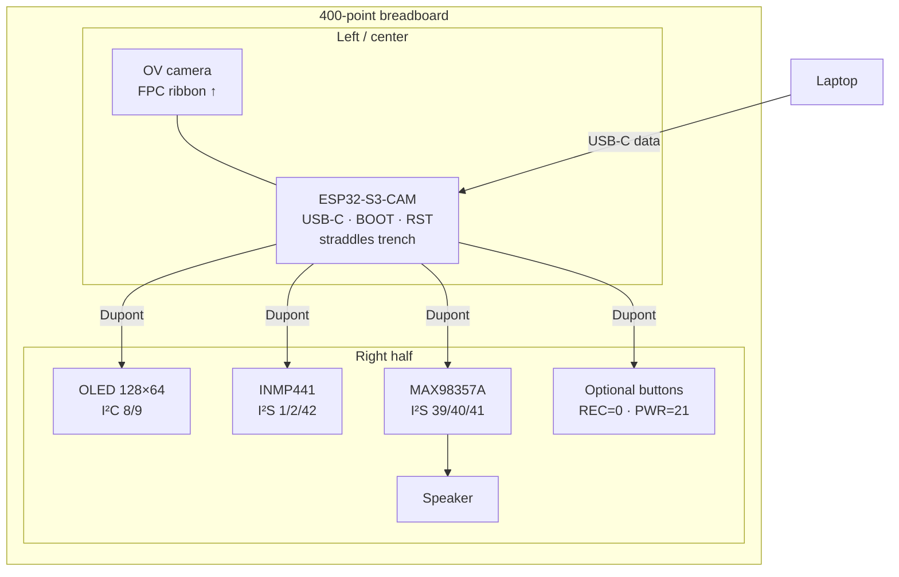
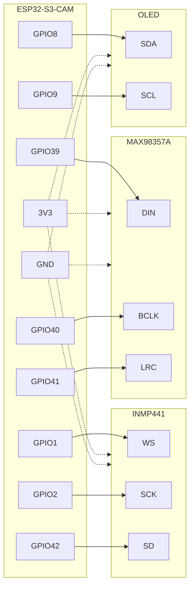

# Physical components — beginner build guide

Step-by-step guide for assembling the **DIY AI Voice & Vision** kit and getting from **“board shows up on USB”** to **running Zoop** on your laptop and (later) on the ESP32-S3.

**Assumes you already installed software tools** from [`scripts/README.md`](../scripts/README.md) (Rust, cargo, espup, etc.).

| Doc | When to use it |
| --- | --- |
| This file | Wires, breadboard, what each part is, first power-on |
| [`scripts/README.md`](../scripts/README.md) | Install Rust / esp-rs on a fresh laptop |
| [`docs/qr/hardware.md`](../docs/qr/hardware.md) | Pin table (source of truth for GPIOs) |
| [§ Public repos (photos & pin maps)](#public-repos--see-the-connections) | Community photos / pin headers to *see* how cams wire up |
| [`TODO_qr.md`](../TODO_qr.md) | QR scan → string product track |
| [`firmware-qr/`](../firmware-qr/) | Host decode + OLED UI demo today |

> **Safety first:** Power off (unplug USB) before changing wires. Never short **3V3** to **GND**. Speakers go on the amp’s **Audio+/Audio−**, not directly on ESP32 GPIO.

---

## Public repos — see the connections

Zoop’s pin numbers for the DIY AI Voice kit are in [`docs/qr/hardware.md`](../docs/qr/hardware.md). To **visually** learn how ESP32 camera boards, I²C OLED taps, mics, and amps look when wired, use these public projects (they are **not** Zoop firmware — study hardware only, then come back here).

### Primary: [s60sc/ESP32-CAM_MJPEG2SD](https://github.com/s60sc/ESP32-CAM_MJPEG2SD)

ESP32 / ESP32-S3 camera app (MJPEG → SD, optional mic WAV, browser stream). Excellent for **board variants**, **free GPIO limits**, **I²S mic/amp**, and **I²C OLED** notes.

| Look at this | Why it helps a beginner |
| --- | --- |
| [Repository home / README](https://github.com/s60sc/ESP32-CAM_MJPEG2SD) | Supported boards (Freenove S3 Cam, XIAO Sense, AI Thinker style), feature list |
| [extras/I2C.jpg](https://github.com/s60sc/ESP32-CAM_MJPEG2SD/blob/master/extras/I2C.jpg) | **Photo** of soldering shared I²C (SDA/SCL) onto an AI Thinker–style cam — orange = SDA, white = SCL |
| [README → I2C Devices](https://github.com/s60sc/ESP32-CAM_MJPEG2SD#i2c-devices) | How OLED / sensors share I²C with the camera; when to use separate SDA/SCL |
| [README → Audio Recording](https://github.com/s60sc/ESP32-CAM_MJPEG2SD#audio-recording) | I²S mic (e.g. **INMP441**) needs 3 pins; PDM notes; gain |
| [README → Amplifier](https://github.com/s60sc/ESP32-CAM_MJPEG2SD#amplifier) | I²S amp + speaker; on S3, amp can **share clocks** with the mic |
| [README → Other peripherals](https://github.com/s60sc/ESP32-CAM_MJPEG2SD#other-peripherals) | Which pins are safe / unsafe on classic ESP32-CAM (don’t steal PSRAM pins) |
| [`camera_pins.h`](https://github.com/s60sc/ESP32-CAM_MJPEG2SD/blob/master/camera_pins.h) | Per-board **camera DVP pin maps** (which GPIOs the OV sensor uses) |
| [`extras/`](https://github.com/s60sc/ESP32-CAM_MJPEG2SD/tree/master/extras) | Extra screenshots / diagrams from the project |

**How to use that repo with Zoop (don’t get lost):**

1. Open the README and pick the section that matches your part (camera board / I²C / audio).
2. Open [`extras/I2C.jpg`](https://raw.githubusercontent.com/s60sc/ESP32-CAM_MJPEG2SD/master/extras/I2C.jpg) in a browser tab while wiring OLED — compare to our breadboard I²C steps below.
3. Skim `camera_pins.h` for your board `#define` (e.g. Freenove S3) so you know which GPIOs are **already taken by the camera**.
4. Wire Zoop using **our** KS5028-class table in [§5](#5-wiring--step-by-step) — MJPEG2SD pin choices may differ; the photos teach *technique*, not our exact GPIO numbers.
5. Come back to Zoop host demo: `cargo run -p zoop-firmware-qr`.



### Other useful public references

| Repo / page | What to look for |
| --- | --- |
| [s60sc/ESP32-CAM_MJPEG2SD](https://github.com/s60sc/ESP32-CAM_MJPEG2SD) | Camera + mic + amp + I²C OLED ecosystem (above) |
| [espressif/esp32-camera](https://github.com/espressif/esp32-camera) | Official `esp_camera` driver; board pin examples in `examples/` |
| [Waveshare ESP32-S3-CAM wiki](https://www.waveshare.com/wiki/ESP32-S3-CAM) (if you have that SKU) | Vendor pinout diagrams / FPC camera notes |
| Your kit vendor doc (e.g. Keyestudio KS5028) | Exact Dupont tables for **your** breadboard kit |

> Zoop does **not** vendor-lock to MJPEG2SD. We link it so beginners can **see** real boards and solder/Dupont practice before trusting abstract GPIO tables.

---

## 1. What’s in the box (must-have checklist)

Lay everything on the desk and tick each item:

| # | Part | Looks like | What it does |
| --- | --- | --- | --- |
| 1 | **ESP32-S3 Camera Board** | Small PCB + USB-C + camera connector | The “brain” — Wi‑Fi, CPU, camera interface |
| 2 | **Camera module** (OV2640 / similar) | Tiny lens on a ribbon cable | Eyes for QR / vision |
| 3 | **OLED** (SSD1306 128×64, I²C) | Blue/white rectangular screen, 4 pins | Shows status text |
| 4 | **INMP441** microphone | Small breakout with L/R, WS, SCK, SD, VDD, GND | Digital mic (I²S) |
| 5 | **MAX98357A** amp | Small breakout with DIN, BCLK, LRC, Vin, GND, speaker pads | Turns digital audio into speaker drive |
| 6 | **Speaker** | 8Ω (or 4Ω) cavity / bare speaker | Beeps and voice |
| 7 | **Breadboard(s)** | White plastic with holes | Solderless wiring playground |
| 8 | **Dupont / jumper wires** | M-M, M-F as needed | Connections |
| 9 | **Type-C data cable** | Must transfer data (not charge-only) | Flash + serial log |
| 10 | **(Optional) 2× buttons** | Tactile switches | Confirm / cancel (REC / PWR) |

Optional later: LiPo battery + charger board, extra LEDs, second breadboard.

---

## 2. Big picture — how the kit talks



**Buses in plain English:**

| Bus | Wires | Used for |
| --- | --- | --- |
| **I²C** | SDA + SCL (+ 3V3 + GND) | OLED — two shared data wires |
| **I²S** | BCLK + WS/LRC + DATA (+ power) | Mic and amp — digital audio |
| **USB** | Type-C cable | Power + programming + serial prints |
| **Camera FPC** | Flat ribbon | Camera — no Dupont wires |

---

## 3. Breadboard basics (5 minutes)

A breadboard lets you plug wires without soldering.

```text
        +  +  -  -     ← power rails (usually linked along the long edge)
     ┌────────────────────────────┐
     │ a b c d e   f g h i j     │
  1  │ ○ ○ ○ ○ ○   ○ ○ ○ ○ ○     │  ← row 1: a–e are connected together
  2  │ ○ ○ ○ ○ ○   ○ ○ ○ ○ ○     │     f–j are a separate group
     │ ...                        │
     └────────────────────────────┘
```

**Rules that save hours of debugging:**

1. **Rows vs columns** — In the center, holes in the **same row** (`1a–1e`) are connected. The gap in the middle **breaks** the connection (`1e` is **not** connected to `1f`).
2. **Power rails** — The long `+` / `−` strips on the sides are for **3V3** and **GND**. Run one red wire from board **3V3 → + rail**, one black from **GND → − rail**, then tap power from the rails.
3. **Common ground** — Every module’s **GND must** meet the ESP32 **GND** (same rail). Floating grounds → random noise / no audio.
4. **One pin, one job** — Don’t put two signals on the same GPIO unless the docs say they are shared.
5. **Color code (suggestion)** — Red = 3V3, Black = GND, Yellow/Orange = clocks, Green/Blue = data, White = misc.

### Breadboard with everything installed (top view)

Seat the ESP32 across the center trench (classic DevKit style). Put peripherals on the **right** half so Dupont runs stay short. CAM boards vary — if yours only has pin holes, solder male headers first.

```text
                    USB-C ──► laptop
                         │
                    ┌────┴────┐
                    │  lens   │  ◄── OV camera on FPC (not on breadboard holes)
                    └────┬────┘
                         │ ribbon
  +3V3 rail ════════════════════════════════════════════════ +3V3
  GND  rail ════════════════════════════════════════════════ GND
       ┌──────────────────────────────────────────────────────────┐
       │  +  -     a b c d e ║ f g h i j     -  +                 │
       │                                                          │
       │           ┌─────────────────┐                            │
       │           │  ESP32-S3-CAM   │  BOOT  RST                 │
       │           │  (straddles ║)  │────┬───┬──                 │
       │           │   USB-C ▲       │    │   │                   │
       │           └─────────┬───────┘    │   │                   │
       │                     │            │   └─ optional REC btn │
       │         GPIOs out ──┤            └───── to GND           │
       │                     │                                    │
       │                     │   ┌──────────────┐                 │
       │                     ├──►│ OLED 128×64  │  SDA←8 SCL←9    │
       │                     │   │ VCC GND SCL  │                 │
       │                     │   │     SDA      │                 │
       │                     │   └──────────────┘                 │
       │                     │                                    │
       │                     │   ┌──────────────┐                 │
       │                     ├──►│   INMP441    │  WS←1 SCK←2     │
       │                     │   │ mic breakout │  SD←42          │
       │                     │   │ L/R → GND    │                 │
       │                     │   └──────────────┘                 │
       │                     │                                    │
       │                     │   ┌──────────────┐     ┌─────────┐ │
       │                     └──►│  MAX98357A   │────►│ SPEAKER │ │
       │                         │ DIN BCLK LRC │     │  +   -  │ │
       │                         │ Vin GND      │     └─────────┘ │
       │                         └──────────────┘                 │
       │                                                          │
       │   (opt) PWR btn ●── GPIO21 ── GND                        │
       └──────────────────────────────────────────────────────────┘

  Legend:  ║ = center trench (left a–e  ≠  right f–j)
           ══ = power rails (tap 3V3 / GND for every module)
           →  = Dupont jumpers (see pin table in §5)
```

Same layout as a block diagram:



| Zone | Parts | Tip |
| --- | --- | --- |
| Top of MCU | Camera ribbon | Keep cable flat; don’t route Dupont over the latch |
| Center | ESP32-S3-CAM | One row of pins on each side of `║` |
| Upper right | OLED | Facing you so you can read “ZOOP QR” |
| Mid right | INMP441 | Mic hole facing outward (away from speaker) |
| Lower right | MAX98357A + speaker | Short speaker leads; amp Vin from **3V3** rail |
| Rails | All VCC/GND | Red → `+`, black → `−`, then jump to each module |

---

## 4. Identify each component

### 4.1 ESP32-S3 Camera Board

- **USB-C** — laptop
- **BOOT / IO0** and **RST / EN** — flash and reset buttons
- **Camera FPC** — thin connector; metal contacts usually face down (check your board)
- **GPIO silk** — tiny numbers next to pins; **trust silkscreen over memory**

### 4.2 Camera ribbon

1. Power **off**.
2. Lift the FPC latch (brown/black bar).
3. Insert ribbon straight; close latch until it clicks.
4. Wrong way in = no image (usually doesn’t smoke, but reseat carefully).

### 4.3 OLED (4-pin I²C)

Typical labels: `VCC`, `GND`, `SCL`, `SDA`  
Some boards use `VDD` instead of `VCC`. Use **3.3V**, not 5V, unless the module is 5V-tolerant and documented as such.

### 4.4 INMP441

Labels: `VDD`, `GND`, `WS`, `SCK`, `SD`, `L/R`  
**L/R → GND** selects the left channel (common kit default).

### 4.5 MAX98357A

Labels: `DIN`, `BCLK`, `LRC`, `Vin`/`VDD`, `GND`, plus **Audio+ / Audio−** (or screw terminals) for the speaker.  
Often **SD** (shutdown) is tied to **Vin** so the amp stays on.

### 4.6 Speaker

Two wires → amp **Audio+** and **Audio−**. Polarity usually doesn’t matter for a beep; match +/− if marked.

---

## 5. Wiring — step by step

Use this **draft map** (Keyestudio **KS5028**-class). If your kit manual disagrees, **follow your kit manual** and update [`docs/qr/hardware.md`](../docs/qr/hardware.md).



### Step 0 — Power rails

| From ESP32 | To breadboard |
| --- | --- |
| **3V3** | `+` rail |
| **GND** | `−` rail |

Do **not** power modules from 5V unless the part explicitly requires it.

### Step 1 — Camera only (no Dupont)

Connect the ribbon to the FPC socket. Power on later with USB and confirm the board boots (LED / serial). Camera image comes after firmware supports `esp_camera`.

### Step 2 — Microphone (INMP441)

| ESP32-S3-CAM | INMP441 |
| --- | --- |
| GPIO **1** | **WS** |
| GPIO **2** | **SCK** |
| GPIO **42** | **SD** |
| **3V3** | **VDD** |
| **GND** | **GND** |
| **GND** | **L/R** (jumper / short) |

### Step 3 — Amplifier + speaker (MAX98357A)

| ESP32-S3-CAM | MAX98357A |
| --- | --- |
| GPIO **39** | **DIN** |
| GPIO **40** | **BCLK** |
| GPIO **41** | **LRC** |
| **3V3** | **Vin** (and often **SD** tied to Vin) |
| **GND** | **GND** |
| — | **Audio+ / Audio−** → speaker |

### Step 4 — OLED

| ESP32-S3-CAM | OLED |
| --- | --- |
| GPIO **8** | **SDA** |
| GPIO **9** | **SCL** |
| **3V3** | **VCC** |
| **GND** | **GND** |

If the OLED stays blank later: many modules are address `0x3C`; check soldering and that SDA/SCL aren’t swapped.

### Step 5 — Optional buttons

| Function | GPIO (draft) | Wiring |
| --- | --- | --- |
| REC / confirm | **0** (BOOT) | Button between GPIO0 and GND; use internal pull-up in firmware |
| PWR / cancel | **21** | Same pattern to GND |

Avoid putting PWR on GPIO **1** on KS5028-class kits — that pin is **mic WS**.

### Step 6 — Visual check before USB

- [ ] No loose strands shorting adjacent pins  
- [ ] All GND pins on the same rail  
- [ ] Speaker only on the amp  
- [ ] Camera latch closed  
- [ ] USB cable is data-capable  

---

## 6. First power-on (hardware hello)

1. Plug USB-C into the board and the laptop.
2. Look for a serial device:
   - macOS: `/dev/cu.usbserial-*` or `/dev/cu.usbmodem*`
   - Linux: `/dev/ttyUSB0` or `/dev/ttyACM0`
   - Windows: COMx in Device Manager
3. If nothing appears: try another cable, another port, or install CH340/CP210x drivers ([`scripts/README.md`](../scripts/README.md) Layer C).

You have not flashed Zoop yet — seeing a COM port **is** the first hardware win.

---

## 7. Software path: host hello → Zoop project

Do this **even before** fancy firmware on the board. Zoop’s QR decode and OLED *framebuffer* already run on your laptop.

### Milestone A — Laptop tools work

```bash
# from repo root
bash scripts/macos-setup.sh --host-only   # or linux / windows / termux
# or full: bash scripts/macos-setup.sh
```

### Milestone B — Host “hello Zoop” (no board)

```bash
cargo test -p zoop-core qr::
cargo test -p zoop-core oled
cargo run -p zoop-firmware-qr
```

Expected: a JSON line with a decoded UPI-like payload and OLED ink counts, e.g.

```text
{"ok":true,"payload":"upi://pay?pa=merchant@oksbi&am=200.00", ... "oled":{...}}
```

This proves: **QR decode + OLED UI code** in `zoop-core` work on your machine.

### Milestone C — ESP toolchain hello (board connected)

```bash
. ~/export-esp.sh
cd firmware
cp -n secrets.example.toml secrets.toml   # edit later for Wi‑Fi
cargo build
```

If build fails, see the symptom table in [`scripts/README.md`](../scripts/README.md).

### Milestone D — Flash collect firmware (e-Paper track)

The main `firmware/` crate targets the **Waveshare e-Paper** board. On the **camera kit**, it may not match pins — use it to practice **flash + serial monitor**:

```bash
. ~/export-esp.sh
cd firmware
cargo espflash flash --monitor
```

If auto-reset fails: hold **BOOT**, tap **RST**, release **BOOT**, then flash again.

You should see UART logs at **115200** baud.

### Milestone E — Camera / QR track (this kit’s product path)

| Today (host) | Next (on kit) |
| --- | --- |
| `cargo run -p zoop-firmware-qr` | Phase 3 in [`TODO_qr.md`](../TODO_qr.md): `esp_camera` → `decode_grayscale` → OLED |
| Pin constants in `firmware-qr/src/board/pins.rs` | Real I²C OLED + I²S beep drivers |

Development loop once camera firmware exists:

1. Edit logic in `core/` → `cargo test`
2. Build firmware-qr for ESP32-S3 → flash
3. Point camera at a printed QR → string on UART / OLED

---

## 8. Learning ladder (what to try, in order)

| Step | Goal | Success looks like |
| --- | --- | --- |
| 1 | Breadboard + power rails | No shorts; board powers from USB |
| 2 | USB serial seen by OS | Port appears |
| 3 | Host Zoop demo | `zoop-firmware-qr` prints JSON |
| 4 | Flash *any* ESP32-S3 blink / log sketch or Zoop `firmware` | Serial text after reset |
| 5 | Wire OLED only | Screen lights / shows garbage or logo once firmware draws |
| 6 | Wire amp + speaker | Short beep from test firmware |
| 7 | Wire mic | Level meter or serial “rms=” debug |
| 8 | Camera frames | Grayscale capture → QR string (Phase 3) |

Don’t wire everything and debug everything at once. **Add one peripheral per evening.**

---

## 9. Common beginner mistakes

| Mistake | Fix |
| --- | --- |
| Charge-only USB cable | Use a data cable |
| 5V into 3.3V-only OLED/mic | Use **3V3** rail |
| Forgotten common GND | Tie every GND to ESP GND |
| SDA/SCL swapped | Swap the two wires |
| Speaker on GPIO | Must go through MAX98357A |
| Mic L/R floating | Tie L/R to GND (left) as in kit docs |
| Flashing without download mode | BOOT + RST sequence |
| Editing pins in code but not on breadboard | Keep [`docs/qr/hardware.md`](../docs/qr/hardware.md) and wires in sync |

---

## 10. Pin cheat sheet (print / keep open)

| Function | GPIO | Module pin |
| --- | --- | --- |
| Mic WS | 1 | INMP441 WS |
| Mic SCK | 2 | INMP441 SCK |
| Mic SD | 42 | INMP441 SD |
| Amp DIN | 39 | MAX98357 DIN |
| Amp BCLK | 40 | MAX98357 BCLK |
| Amp LRC | 41 | MAX98357 LRC |
| OLED SDA | 8 | OLED SDA |
| OLED SCL | 9 | OLED SCL |
| REC button | 0 | to GND |
| PWR button | 21 | to GND |
| Camera | FPC | onboard |

Code mirror: [`firmware-qr/src/board/pins.rs`](../firmware-qr/src/board/pins.rs).

---

## 11. Where to go next

1. Finish laptop setup → [`scripts/README.md`](../scripts/README.md)  
2. Run host QR/OLED demo → `cargo run -p zoop-firmware-qr`  
3. Read product phases → [`TODO_qr.md`](../TODO_qr.md)  
4. When camera firmware lands, flash, aim at a QR, confirm string on OLED  

Welcome — once USB + host demo work, you’re already developing Zoop. The breadboard is just the last mile to the real kit.
